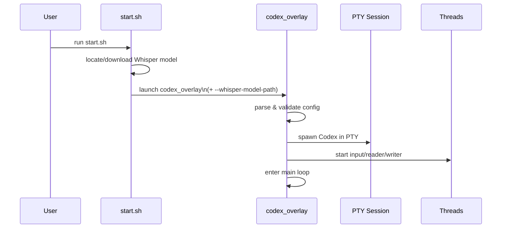
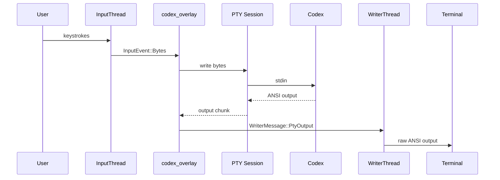
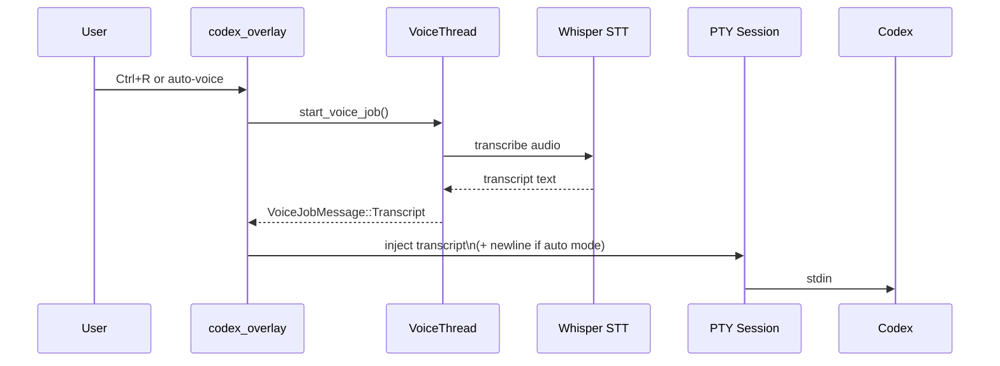
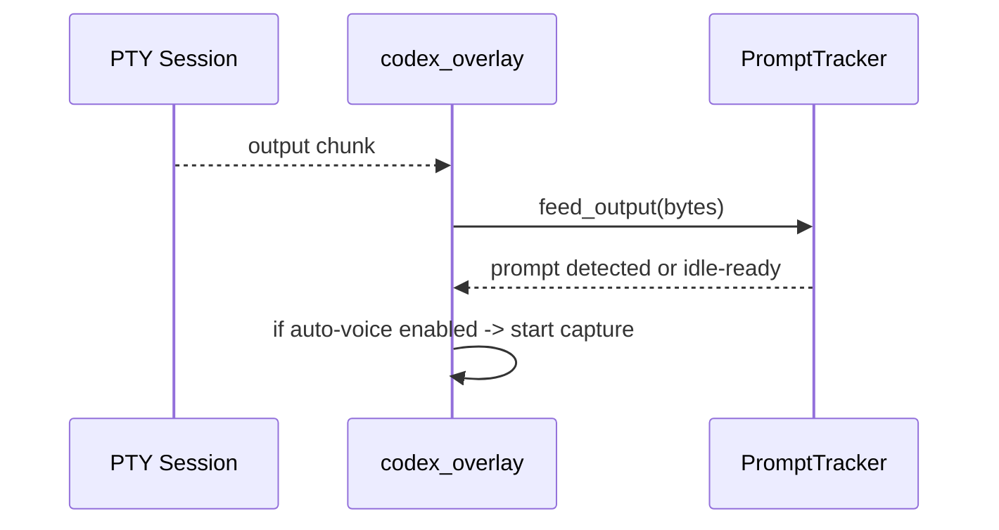
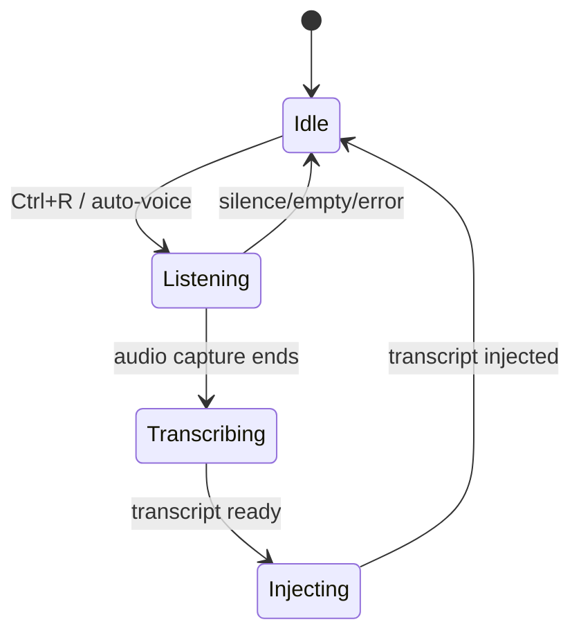
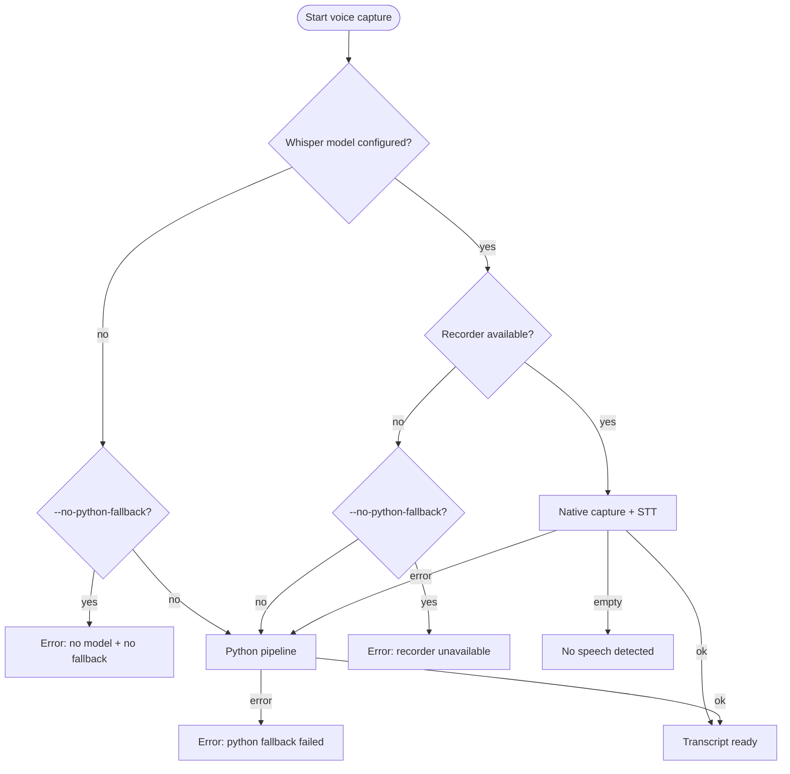
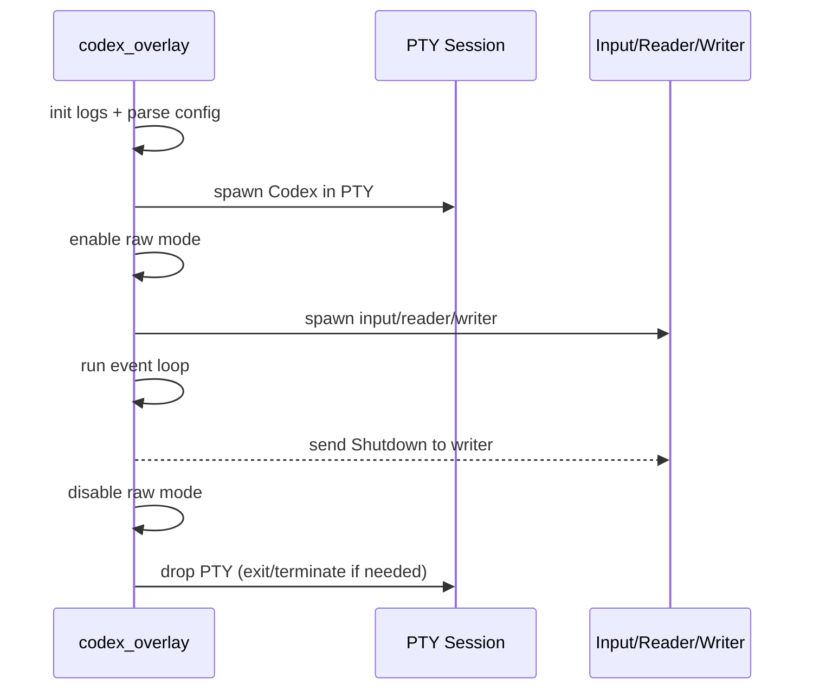

# Codex Voice (Rust Overlay) Architecture

This document describes the Rust-only overlay mode. It runs the Codex CLI in a PTY and
adds voice capture + a minimal status overlay without touching Codex's native UI.

## Goals

- Preserve the **full Codex TUI** (raw ANSI passthrough).
- Add **voice capture** and **auto-voice** without corrupting terminal output.
- Keep a **minimal overlay** (one status line) and avoid custom UI rendering.

## System Overview (Rust Only)

```mermaid
graph LR
  Terminal[Terminal (TTY)] <--> Input[Raw input reader]
  Input --> Overlay[codex_overlay main loop]
  Overlay --> PTY[PtyOverlaySession]
  PTY --> Codex[Codex CLI]
  Codex --> PTY
  PTY --> Writer[Serialized writer]
  Writer --> Terminal

  Voice[Voice pipeline] --> Overlay
  Overlay -->|transcript| PTY

  Prompt[Prompt detector] <-- PTY
  Prompt --> Overlay
```

What this means:
- The **terminal is the frontend**; the overlay doesn't replace Codex's UI.
- The overlay **injects transcripts** as if typed by the user.
- The status line is drawn at the bottom using ANSI save/restore.

## Threads + Channels

```mermaid
graph TD
  Main[codex_overlay main loop]
  InputThread[Input thread\n(reads stdin bytes)]
  PtyReader[PTY reader thread\n(raw ANSI output)]
  WriterThread[Writer thread\n(serializes output + status)]
  VoiceThread[Voice worker thread\n(capture + STT)]

  InputThread -->|InputEvent| Main
  PtyReader -->|PTY output| Main
  Main -->|WriterMessage| WriterThread
  Main -->|start voice| VoiceThread
  VoiceThread -->|VoiceJobMessage| Main
```

Why this matters:
- **Input thread** intercepts Ctrl+R/Ctrl+V/Ctrl+Q without blocking Codex.
- **PTY reader** keeps ANSI intact while replying to terminal queries (DSR/DA).
- **Writer thread** prevents output + status line interleaving.
- **Voice thread** keeps audio/Whisper work off the main loop.

## Startup Sequence



## Core Flows

### 1) Keyboard -> Codex -> Terminal



### 2) Voice -> Whisper -> Transcript -> Codex



### 3) Auto-Voice (Prompt Detection)



## Overlay State Machine



## Whisper Integration (Rust)

- **Primary path:** `stt::Transcriber` uses `whisper-rs` with the model at
  `--whisper-model-path`.
- **Fallback:** if no model is configured or native capture fails, the code falls
  back to Python (`scripts/codex_voice.py`) unless `--no-python-fallback` is set.

Common setup path:
- `./scripts/setup.sh models --base` downloads `models/ggml-base.en.bin`.
- `start.sh` passes `--whisper-model-path` into `codex_overlay`.

## Voice Error + Fallback Flow



Notes:
- Python fallback requires `python3`, `ffmpeg`, and the `whisper` CLI on PATH.
- Use `--no-python-fallback` to force native Whisper and surface errors early.
- When fallback is active, the overlay status line shows "Python pipeline" and logs record the switch.

## Timing + Latency (Voice + Codex)

```mermaid
graph LR
  Capture[Capture audio with VAD] --> STT[Whisper transcription]
  STT --> Inject[Inject transcript into PTY]
  Inject --> Codex[Codex response (external)]
```

Timing observability:
- Voice capture logs: `voice_metrics|capture_ms=...|speech_ms=...|...`
- If `--log-timings` is set, also logs:
  `timing|phase=voice_capture|record_s=...|stt_s=...|chars=...`

## Safety + External Dependencies

```mermaid
graph TD
  Overlay[codex_overlay] --> Codex[Codex CLI]
  Overlay --> Whisper[Whisper (native, whisper-rs)]
  Overlay --> Py[Python fallback]
  Py --> WhisperCli[whisper CLI]
  Py --> FFmpeg[ffmpeg]
```

Safety constraints in code:
- CLI binary paths are validated (`--codex-cmd`, `--python-cmd`, `--ffmpeg-cmd`, `--whisper-cmd`).
- `--ffmpeg-device` is restricted to avoid shell metacharacters.
- `--whisper-model-path` must exist and is canonicalized.
- Overlay only intercepts control hotkeys; all other bytes go directly to Codex.

## Resource Lifecycle (Startup / Shutdown)



## Prompt Detection (Auto-Voice)

- Strip ANSI escape sequences from PTY output.
- Track the current line + last completed line.
- If a regex is provided (`--prompt-regex`), match against it.
- Otherwise, **learn** the prompt from the first idle line and match it later.
- Fallback: if no prompt is known, trigger auto-voice after an idle timeout.

## PTY Handling + Resize

- `PtyOverlaySession` uses `openpty` and forks Codex into the slave PTY.
- It **replies to terminal queries** (DSR/DA) but leaves all ANSI intact.
- On SIGWINCH, `ioctl(TIOCSWINSZ)` updates the PTY size and forwards SIGWINCH to Codex.

## Output Serialization

All terminal output is serialized through one writer thread to avoid
interleaving PTY output with the status line. The status line is drawn using
ANSI save/restore (`ESC 7` / `ESC 8`) to avoid corrupting Codex's screen.

## Key Files

- `rust_tui/src/bin/codex_overlay.rs` - main loop, input handling, prompt detection
- `rust_tui/src/pty_session.rs` - raw PTY passthrough + query replies
- `rust_tui/src/voice.rs` - voice capture job orchestration
- `rust_tui/src/audio.rs` - CPAL recorder + VAD
- `rust_tui/src/stt.rs` - Whisper transcription
- `rust_tui/src/config.rs` - CLI flags + validation

## Config Knobs

- `--whisper-model-path` - load native Whisper model
- `--voice-send-mode auto|insert` - auto-send transcript or insert for editing
- `--auto-voice` - enable auto mode on startup
- `--auto-voice-idle-ms` - idle timeout before auto-voice triggers
- `--prompt-regex` - override prompt detection
- `CODEX_VOICE_CWD` - run Codex in a chosen project directory

## Debugging + Logs

- Logs: `${TMPDIR}/codex_voice_tui.log`
- Prompt detection log: `${TMPDIR}/codex_overlay_prompt.log`
- Use `--no-python-fallback` to force native Whisper and surface errors early.
