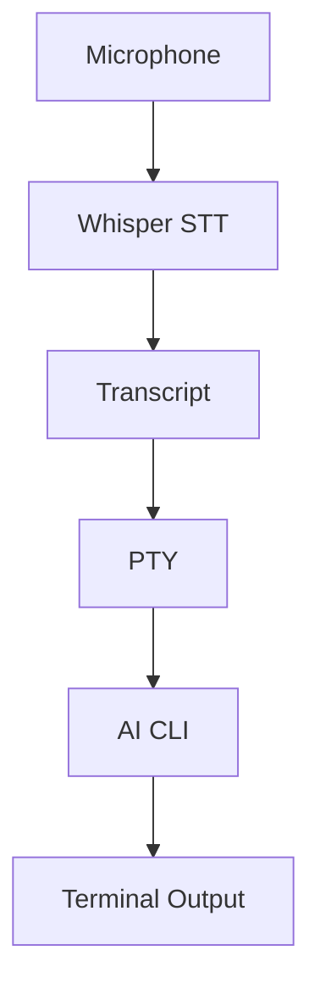
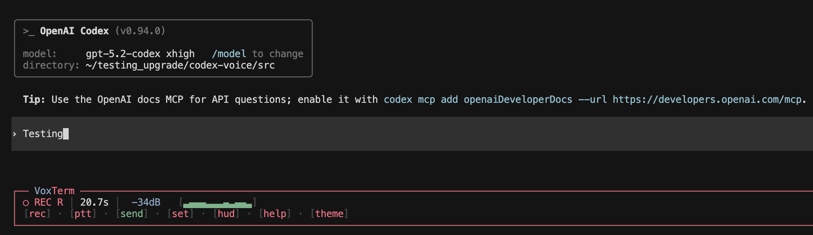
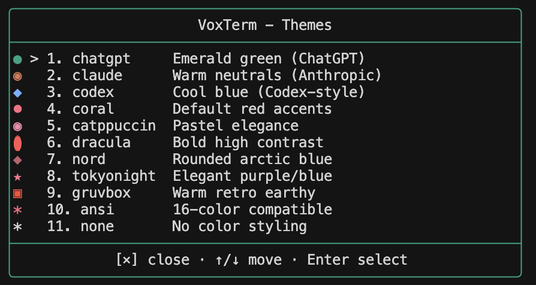
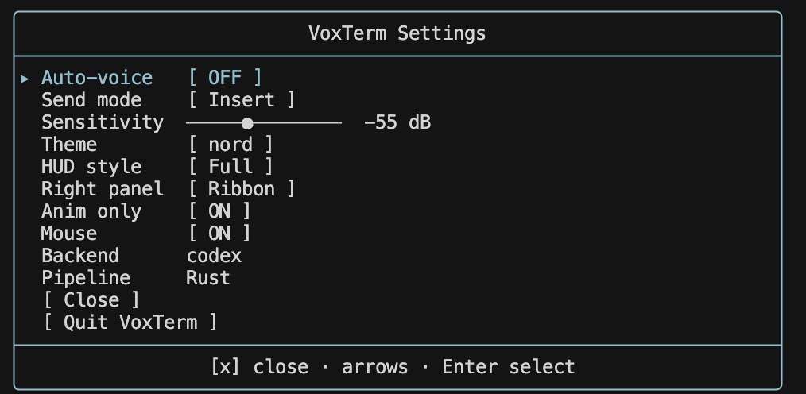

<p align="center">
  
</p>

<p align="center">
  
  
  
  
  <a href="dev/CHANGELOG.md"></a>
  <a href="LICENSE"></a>
</p>

<p align="center">
  <a href="https://github.com/jguida941/voiceterm/actions/workflows/rust_ci.yml"></a>
  <a href="https://github.com/jguida941/voiceterm/actions/workflows/mutation-testing.yml"></a>
</p>

Voice input for AI CLIs. Talk instead of type.
Runs Whisper locally with ~250ms latency. No cloud, no API keys.

## Quick Nav

- [Install and Start](#install-and-start)
- [How It Works](#how-it-works)
- [Requirements](#requirements)
- [Supported AI CLIs](#supported-ai-clis)
- [UI Tour](#ui-tour)
- [Controls](#controls)
- [Documentation](#documentation)
- [Support](#support)

## Install and Start

Install one supported AI CLI first:

**Codex:**
```bash
npm install -g @openai/codex
```

**Claude Code:**
```bash
curl -fsSL https://claude.ai/install.sh | bash
```

Then choose one VoiceTerm setup path:

<details open>
<summary><strong>Homebrew (recommended)</strong></summary>

```bash
brew tap jguida941/voiceterm
brew install voiceterm
cd ~/your-project
voiceterm
```

If needed, authenticate once:
```bash
voiceterm --login --codex
voiceterm --login --claude
```
</details>

<details>
<summary><strong>PyPI (pipx / pip)</strong></summary>

```bash
pipx install voiceterm
# or: python3 -m pip install --user voiceterm

cd ~/your-project
voiceterm
```

If needed, authenticate once:
```bash
voiceterm --login --codex
voiceterm --login --claude
```
</details>

<details>
<summary><strong>From source</strong></summary>

```bash
git clone https://github.com/jguida941/voiceterm.git
cd voiceterm
./scripts/install.sh
```
</details>

<details>
<summary><strong>macOS App</strong></summary>

Double-click `app/macos/VoiceTerm.app`, pick a folder, and it opens Terminal
with VoiceTerm running.
</details>

For model options and startup/IDE tuning:
- [Install Guide](guides/INSTALL.md)
- [Whisper docs](guides/WHISPER.md)
- [Troubleshooting](guides/TROUBLESHOOTING.md)

## How It Works



VoiceTerm wraps your AI CLI in a PTY and adds voice input.
You talk → Whisper transcribes locally → text gets typed into the CLI.
All CLI output passes through unchanged.

## Requirements

- macOS or Linux (Windows needs WSL2)
- Microphone access
- ~0.5 GB disk for the default small model (base is ~142 MB, medium is ~1.5 GB)

## Features

| Feature | Description |
|---------|-------------|
| **Local STT** | Whisper runs on your machine - no cloud calls |
| **~250ms latency** | Fast transcription through whisper.cpp |
| **PTY passthrough** | CLI UI stays unchanged |
| **Auto-voice** | Hands-free mode - no typing needed |
| **Transcript queue** | Speak while CLI is busy, types when ready |
| **Project voice macros** | Expand trigger phrases from `.voiceterm/macros.yaml` before typing |
| **Macros toggle** | Runtime ON/OFF control for macro expansion from Settings |
| **Adaptive HUD telemetry** | Compact meter/latency trend chips that adapt to recording, busy, and idle states |
| **Backends** | Primary support for Codex and Claude Code |
| **Themes** | 11 built-in themes including ChatGPT, Catppuccin, Dracula, Nord, Tokyo Night, Gruvbox |

## Voice Recording


## Supported AI CLIs

VoiceTerm is optimized for Codex and Claude Code.
For canonical backend support status and experimental backend notes, see
[Usage Guide -> Backend Support](guides/USAGE.md#backend-support).
For advanced backend configuration, see the [Usage Guide](guides/USAGE.md).

### Codex

```bash
npm install -g @openai/codex
voiceterm
voiceterm --codex   # explicit (optional)
voiceterm --login --codex
```



### Claude Code

```bash
curl -fsSL https://claude.ai/install.sh | bash
voiceterm --claude
voiceterm --login --claude
```


## UI Tour

### Theme Picker


Use ↑/↓ to move and Enter to select, or type the theme number.

### Settings Menu



Mouse control is enabled by default, and Settings (`Ctrl+O`) covers the main
runtime toggles: send mode, auto-voice, macros, HUD style/border, right-panel
telemetry, and latency display.
See the [Usage Guide](guides/USAGE.md) for full behavior and configuration details.

## Controls

For complete keybindings and behavior details, see:
- [Core Controls](guides/USAGE.md#core-controls)
- [Settings Menu](guides/USAGE.md#settings-menu)
- [Voice Modes](guides/USAGE.md#voice-modes)

## Voice Macros

Voice macros are project-local voice shortcuts defined in
`.voiceterm/macros.yaml`.

Example:
- You say: `run tests`
- VoiceTerm types: `cargo test --all-features`

When it runs:
- `Settings -> Macros = ON`: if a spoken trigger matches, VoiceTerm expands it
  before typing into the CLI.
- `Settings -> Macros = OFF`: VoiceTerm skips expansion and types your
  transcript exactly as spoken.

See [Project Voice Macros](guides/USAGE.md#project-voice-macros) for the file
format, templates, and matching rules.

## Documentation

| Users | Developers |
|-------|------------|
| [Quick Start](QUICK_START.md) | [Development](dev/DEVELOPMENT.md) |
| [Install Guide](guides/INSTALL.md) | [Architecture](dev/ARCHITECTURE.md) |
| [Usage Guide](guides/USAGE.md) | [ADRs](dev/adr/README.md) |
| [CLI Flags](guides/CLI_FLAGS.md) | [Contributing](.github/CONTRIBUTING.md) |
| [Whisper & Languages](guides/WHISPER.md) | [Changelog](dev/CHANGELOG.md) |
| [Troubleshooting Hub](guides/TROUBLESHOOTING.md) | |

Troubleshooting deep dives:
- [Backend issues](guides/TROUBLESHOOTING_BACKEND.md)
- [Terminal/IDE issues](guides/TROUBLESHOOTING_TERMINAL.md)
- [Install/update issues](guides/TROUBLESHOOTING_INSTALL.md)

## Support

- Troubleshooting: [guides/TROUBLESHOOTING.md](guides/TROUBLESHOOTING.md)
- Bug reports and feature requests: [GitHub Issues](https://github.com/jguida941/voiceterm/issues)
- Security concerns: [.github/SECURITY.md](.github/SECURITY.md)

## Contributing

PRs welcome. See [CONTRIBUTING.md](.github/CONTRIBUTING.md).
Before opening a PR, run `python3 dev/scripts/devctl.py check --profile prepush`.
For governance/docs consistency, also run `python3 dev/scripts/devctl.py hygiene`.

## License

MIT - [LICENSE](LICENSE)
