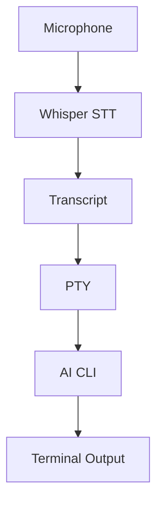

<p align="center">
  
</p>

<p align="center">
  
  
  
  
  <a href="dev/CHANGELOG.md"></a>
  <a href="LICENSE"></a>
</p>

<p align="center">
  <a href="https://github.com/jguida941/voxterm/actions/workflows/rust_ci.yml"></a>
  <a href="https://github.com/jguida941/voxterm/actions/workflows/mutation-testing.yml"></a>
</p>

Voice input for AI CLIs. Talk instead of type.
Runs Whisper locally with ~250ms latency. No cloud, no API keys.

## Quick Nav

- [Quick Start](#quick-start)
- [How It Works](#how-it-works)
- [Requirements](#requirements)
- [Supported AI CLIs](#supported-ai-clis)
- [UI Tour](#ui-tour)
- [Install Options](#install-options)
- [Documentation](#documentation)
- [Support](#support)

## Quick Start

```bash
# Install Codex CLI (default backend)
npm install -g @openai/codex

# Install VoxTerm via Homebrew
brew tap jguida941/voxterm
brew install voxterm

# Run it
cd ~/your-project
voxterm
```

If you haven't authenticated yet:
```bash
voxterm --login --codex
voxterm --login --claude
```

First run downloads a Whisper model (install/start scripts default to base ~142 MB; CLI default is small ~466 MB). To choose a different size:
- `./scripts/install.sh --small`
- `./scripts/setup.sh models --medium`
- Or pass `--whisper-model-path` directly
See [Whisper docs](guides/WHISPER.md) for details.

## How It Works



VoxTerm wraps your AI CLI in a PTY and adds voice input.
You talk → Whisper transcribes locally → text gets typed into the CLI.
All CLI output passes through unchanged.

## Requirements

- macOS or Linux (Windows needs WSL2)
- Microphone access
- ~0.5 GB disk for the default small model (base is ~142 MB, medium is ~1.5 GB)

## Features

| Feature | Description |
|---------|-------------|
| **Local STT** | Whisper runs on your machine - no cloud calls |
| **~250ms latency** | Fast transcription through whisper.cpp |
| **PTY passthrough** | CLI UI stays unchanged |
| **Auto-voice** | Hands-free mode - no typing needed |
| **Transcript queue** | Speak while CLI is busy, types when ready |
| **Project voice macros** | Expand trigger phrases from `.voxterm/macros.yaml` before typing |
| **Command/Dictation mode** | Toggle macro expansion policy independently from send mode |
| **Backends** | Codex + Claude supported; experimental presets for Gemini (not working), Aider, OpenCode |
| **Themes** | 11 built-in themes including ChatGPT, Catppuccin, Dracula, Nord, Tokyo Night, Gruvbox |

## Supported AI CLIs

VoxTerm is optimized for Codex and Claude Code. Experimental presets exist for
Gemini, Aider, and OpenCode, plus custom command strings via `--backend`. Gemini
is currently nonfunctional, and Aider/OpenCode are untested.

### Codex (default)

```bash
npm install -g @openai/codex
voxterm
voxterm --codex   # explicit (optional)
voxterm --login --codex
```


### Claude Code

```bash
curl -fsSL https://claude.ai/install.sh | bash
voxterm --claude
voxterm --login --claude
```


### Experimental presets

These presets exist but are not part of the primary support matrix:
- Gemini CLI (`voxterm --gemini`)
- Aider (`voxterm --backend aider`)
- OpenCode (`voxterm --backend opencode`)
Gemini is currently not working; Aider/OpenCode are untested.

## UI Tour

### Theme Picker (Ctrl+Y)


Use ↑/↓ to move and Enter to select, or type the theme number.

### Settings Menu (Ctrl+O)


Mouse control is on by default (toggle it off in Settings).
You can click HUD buttons or use ←/→ to focus and Enter to activate.
Settings also include `Voice mode` (Command/Dictation) and `Review first`
for transcript edit-before-send behavior.
See the [Usage Guide](guides/USAGE.md) for details.

### Voice Recording


## Controls

| Key | Action |
|-----|--------|
| `Ctrl+R` | Start voice recording |
| `Ctrl+V` | Toggle auto-voice (hands-free) |
| `Ctrl+T` | Toggle send mode (auto/insert) |
| `Ctrl+U` | Cycle HUD style |
| `Ctrl+Y` | Theme picker |
| `Ctrl+O` | Settings menu |
| `Ctrl+]` | Mic less sensitive |
| `Ctrl+\` | Mic more sensitive |
| `?` | Show help |
| `Enter` | Stop recording / send text |
| `Ctrl+Q` | Quit |
| `Ctrl+C` | Send interrupt to CLI |

When Settings -> `Review first` is ON, transcripts are inserted for edit and the
send control shows `review` until you press `Enter`.

## Install Options

<details>
<summary><strong>Homebrew (recommended)</strong></summary>

```bash
brew tap jguida941/voxterm
brew install voxterm
```
</details>

<details>
<summary><strong>From source</strong></summary>

```bash
git clone https://github.com/jguida941/voxterm.git
cd voxterm
./scripts/install.sh
```
</details>

<details>
<summary><strong>macOS App</strong></summary>

Double-click `app/macos/VoxTerm.app`, pick a folder, it opens Terminal with VoxTerm running.


</details>

## Documentation

| Users | Developers |
|-------|------------|
| [Quick Start](QUICK_START.md) | [Development](dev/DEVELOPMENT.md) |
| [Install Guide](guides/INSTALL.md) | [Architecture](dev/ARCHITECTURE.md) |
| [Usage Guide](guides/USAGE.md) | [ADRs](dev/adr/README.md) |
| [CLI Flags](guides/CLI_FLAGS.md) | [Contributing](.github/CONTRIBUTING.md) |
| [Whisper & Languages](guides/WHISPER.md) | [Changelog](dev/CHANGELOG.md) |
| [Troubleshooting](guides/TROUBLESHOOTING.md) | |

## Support

- Troubleshooting: [guides/TROUBLESHOOTING.md](guides/TROUBLESHOOTING.md)
- Bug reports and feature requests: [GitHub Issues](https://github.com/jguida941/voxterm/issues)
- Security concerns: [.github/SECURITY.md](.github/SECURITY.md)

## Contributing

PRs welcome. See [CONTRIBUTING.md](.github/CONTRIBUTING.md).
Before opening a PR, run `python3 dev/scripts/devctl.py check --profile prepush`.
For governance/docs consistency, also run `python3 dev/scripts/devctl.py hygiene`.

## License

MIT - [LICENSE](LICENSE)
