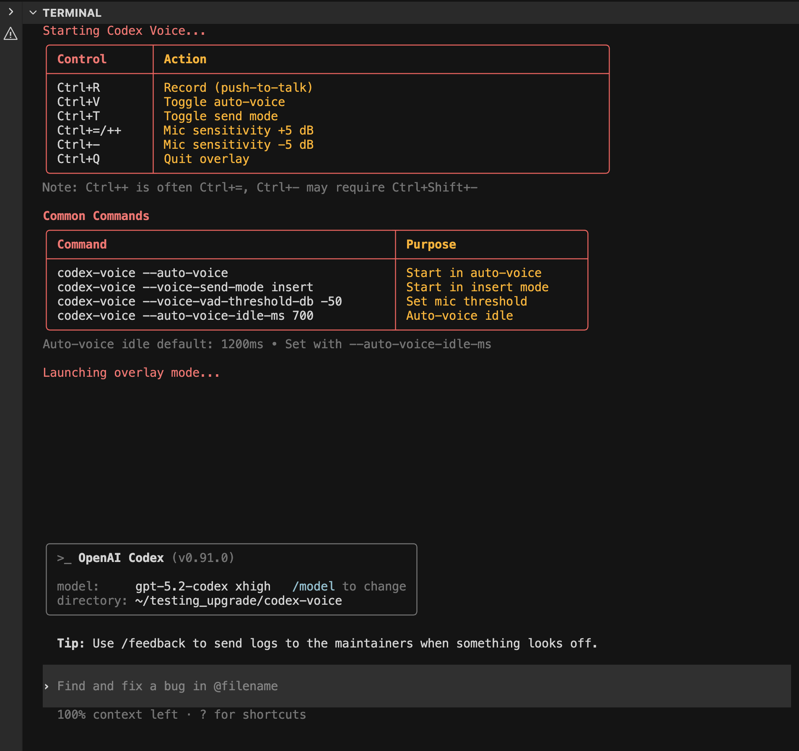
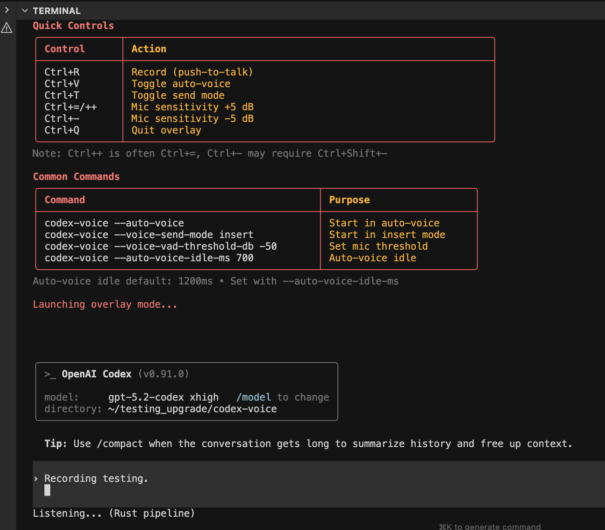
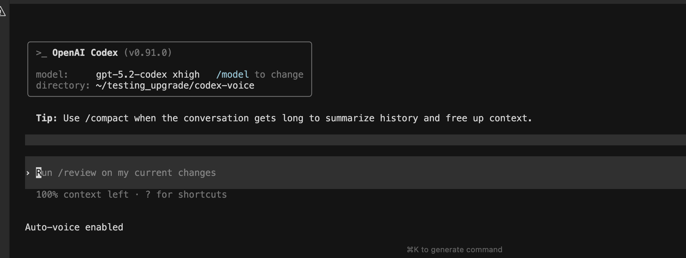
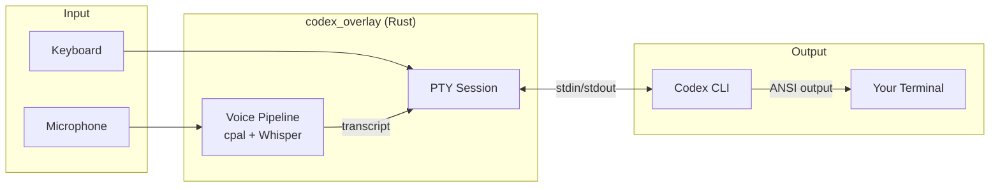

# Codex Voice

**Rust voice overlay for the official Codex CLI. Speak to Codex using local Whisper speech-to-text.** 

Voice transcription runs entirely on your machine via `whisper.cpp`! This means no cloud API calls, and no network latency.      
The Rust overlay simply wraps Codex in a PTY, preserving its complete native UI while injecting voice transcripts.   


## Contents

- [Features](#features)
- [Quick Start](#quick-start) | [QUICK_START.md](QUICK_START.md)
- [Install Options](#install-options)
- [Usage](#usage)
  - [Keyboard Shortcuts](#keyboard-shortcuts)
  - [CLI Flags](#cli-flags)
- [How It Works](#how-it-works)
- [Architecture](#architecture) | [Full Diagrams](docs/ARCHITECTURE.md)
- [Configuration](#configuration)
- [Development](#development)
- [Troubleshooting](#troubleshooting)
- [Changelog](docs/CHANGELOG.md)

## Features

- Voice input via microphone (Whisper STT)
- **Fast local transcription** - ~250ms processing after speech ends, no cloud API calls
- Rust overlay mode that preserves the full Codex TUI (PTY passthrough)
- Auto-voice mode for continuous conversation
- Optional Python fallback when native capture is unavailable

## Quick Start

If you want the shortest path, see [QUICK_START.md](QUICK_START.md).

### Prerequisites

- Rust toolchain (stable)
- Codex CLI (`npm install -g @anthropic-ai/codex`)
- Whisper model (GGML format) in `models/` directory

### Install & Run

```bash
# Clone and enter project
git clone https://github.com/jguida941/codex-voice.git
cd codex-voice

# One-time install (builds overlay, installs wrapper)
# This also downloads a whisper model to the correct path for the CLI
./install.sh

# Run from any project
cd ~/my-project
codex-voice
```

If `codex-voice` is not found, the installer used the first writable directory in this order:   
`/opt/homebrew/bin`, `/usr/local/bin`, `~/.local/bin`, or `/path/to/codex-voice/bin`.    
Add that directory to PATH or set `CODEX_VOICE_INSTALL_DIR` before running `./install.sh`.    
If a `codex-voice` command already exists, the installer skips that location; remove the conflicting
binary or set `CODEX_VOICE_INSTALL_DIR` to override.

Manual build (Rust only):
```bash
cd rust_tui && cargo build --release --bin codex_overlay
./target/release/codex_overlay
```

Use `./start.sh` if you want automatic model download and setup.

## Install Options

### macOS App (folder picker)

1. Double-click **Codex Voice.app**.
2. Pick your project folder.
3. A Terminal window opens and runs the overlay inside that folder.


### Homebrew (optional, global command)

1. Install Homebrew (if needed):

```bash
/bin/bash -c "$(curl -fsSL https://raw.githubusercontent.com/Homebrew/install/HEAD/install.sh)"
```
2. Tap and install:

```bash
brew tap jguida941/homebrew-codex-voice
brew install codex-voice
```

3. Run from any project (first run downloads the model if missing):

```bash
cd ~/my-project
codex-voice
```

Model storage defaults to `~/.local/share/codex-voice/models` for Homebrew installs (or when the
repo directory is not writable). Override with `CODEX_VOICE_MODEL_DIR` if you want a custom path.

Optional pre-download:

```bash
$(brew --prefix)/opt/codex-voice/libexec/scripts/setup.sh models --base
```

### Manual (no Homebrew)

Run from any project folder:

```bash
CODEX_VOICE_CWD="$(pwd)" /path/to/codex-voice/start.sh
```

## Using With Your Own Projects

Codex Voice works with **any codebase** - just run it from your project directory.

### macOS

**Option A:** Double-click **Codex Voice.app** - it will prompt you to select your project folder.

**Option B:** Command line:
```bash
cd ~/my-project
/path/to/codex-voice/start.sh
```

### Windows

Windows native is not supported yet (the overlay uses a Unix PTY). Use WSL2 or a macOS/Linux machine.

### Linux / Command Line

```bash
cd ~/my-project
/path/to/codex-voice/start.sh
```

### Install Globally (macOS/Linux)

```bash
cd /path/to/codex-voice
./install.sh

# Now run from any project
cd ~/my-project
codex-voice
```

## Usage

Overlay mode runs the Codex CLI in a PTY and forwards raw ANSI output. You interact directly with Codex's native UI - no wrapper commands.



---

### Keyboard Shortcuts

| Key | Action |
|-----|--------|
| `Ctrl+R` | Start voice capture |
| `Ctrl+V` | Toggle auto-voice mode |
| `Ctrl+T` | Toggle send mode (auto vs insert) |
| `Ctrl++` | Increase mic threshold +5 dB (often `Ctrl+=`) |
| `Ctrl+-` | Decrease mic threshold -5 dB (may need `Ctrl+Shift+-`) |
| `Ctrl+Q` | Exit overlay |
| `Ctrl+C` | Forward to Codex |

| | |
|---|---|
|  |  |
| **Voice Recording** (`Ctrl+R`) | **Auto-voice Mode** (`Ctrl+V`) |

---

### CLI Flags

Run `codex-voice --help` for all options. Key flags:

#### Voice & Recording

| Flag | Purpose | Default |
|------|---------|---------|
| `--auto-voice` | Start in auto-voice mode | off |
| `--auto-voice-idle-ms <MS>` | Idle timeout before auto-voice triggers | 1200 |
| `--voice-send-mode <auto\|insert>` | `auto` sends newline, `insert` for editing | auto |
| `--voice-vad-threshold-db <DB>` | Mic sensitivity (lower = more sensitive) | -40 |
| `--voice-vad-engine <earshot\|simple>` | VAD implementation | earshot |
| `--input-device <NAME>` | Preferred audio input device | system default |
| `--list-input-devices` | Print available audio devices and exit | - |

#### Whisper & STT

| Flag | Purpose | Default |
|------|---------|---------|
| `--whisper-model-path <PATH>` | Path to Whisper GGML model | required |
| `--whisper-model <NAME>` | Whisper model name | small |
| `--lang <LANG>` | Language for Whisper | en |
| `--no-python-fallback` | Fail instead of Python fallback | off |

#### Advanced

| Flag | Purpose | Default |
|------|---------|---------|
| `--prompt-regex <REGEX>` | Override prompt detection | auto-detect |
| `--codex-cmd <PATH>` | Path to Codex CLI binary | codex |
| `--codex-arg <ARG>` | Extra args to Codex (repeatable) | - |
| `--log-timings` | Enable verbose timing logs | off |
| `--json-ipc` | JSON IPC mode for external integration | off |

---

## How It Works

Overlay mode runs Codex in a real PTY and forwards raw ANSI output directly to your terminal:



The overlay does not parse slash commands; it keeps Codex's native UI intact and only handles
its own hotkeys (Ctrl+R/Ctrl+V/Ctrl+Q).

## Architecture

Overlay mode is Rust-only: `codex_overlay` spawns Codex in a PTY, forwards raw terminal output, and
injects voice transcripts as keystrokes. The terminal itself is the UI, with a minimal status line.

### Components

| Component | Path | Purpose |
|-----------|------|---------|
| Rust Overlay | `rust_tui/src/bin/codex_overlay.rs` | PTY passthrough UI with voice overlay |
| Voice Pipeline | `rust_tui/src/voice.rs` | Audio capture orchestration + STT |
| PTY Session | `rust_tui/src/pty_session.rs` | Raw PTY passthrough and prompt-safe output |
| Python fallback | `scripts/codex_voice.py` | Optional fallback STT pipeline |

See [docs/ARCHITECTURE.md](docs/ARCHITECTURE.md) for full diagrams and data flow.

## Configuration

### Environment Variables

| Variable | Description | Default |
|----------|-------------|---------|
| `CODEX_VOICE_MODEL_DIR` | Override model storage directory | auto (`models/` or `~/.local/share/codex-voice/models`) |
| `CODEX_VOICE_CWD` | Run Codex in a chosen project directory | current directory |
| `CODEX_VOICE_INSTALL_DIR` | Override install location for `./install.sh` | unset |
| `CODEX_OVERLAY_PROMPT_REGEX` | Override prompt detection regex | unset |
| `CODEX_OVERLAY_PROMPT_LOG` | Prompt detection log path | `${TMPDIR}/codex_overlay_prompt.log` |

See [CLI Flags](#cli-flags) for all command-line options.

## Development

### Project Structure

```
codex-voice/
├── Codex Voice.app/     # macOS double-click launcher
├── QUICK_START.md       # Fast setup and commands
├── docs/
│   ├── ARCHITECTURE.md  # Architecture diagrams and data flow
│   └── CHANGELOG.md     # Release history
├── img/                 # Screenshots
├── rust_tui/            # Rust overlay + voice pipeline
│   └── src/
│       ├── main.rs      # Entry point
│       ├── codex.rs     # Provider backend
│       ├── voice.rs     # Voice capture orchestration
│       ├── audio.rs     # CPAL recording, VAD
│       ├── stt.rs       # Whisper transcription
│       └── pty_session.rs # PTY wrapper
├── scripts/             # Setup and test scripts
├── models/              # Whisper GGML models
├── start.sh             # Linux/macOS launcher
└── install.sh           # One-time installer
```

### Building

```bash
# Rust overlay
cd rust_tui && cargo build --release --bin codex_overlay

# Rust backend (optional dev binary)
cd rust_tui && cargo build --release
```

### Testing

```bash
# Rust tests
cd rust_tui && cargo test

# Overlay tests
cd rust_tui && cargo test --bin codex_overlay
```

## Troubleshooting

### Voice not working

1. Check microphone permissions
2. Verify a Whisper model exists (or run `./scripts/setup.sh models --base`)
3. List devices: `codex-voice --list-input-devices`
4. If the status line shows "Python pipeline", install `python3`, `ffmpeg`, and the `whisper` CLI or use `--no-python-fallback`

### Codex not responding

1. Ensure Codex CLI is installed: `which codex`
2. Check authentication: `codex login`
3. Restart `codex-voice` if the PTY session is stuck

### Logs

- `${TMPDIR}/codex_voice_tui.log`
- `${TMPDIR}/codex_overlay_prompt.log`

### Homebrew link conflict

If `brew install codex-voice` cannot link because `codex-voice` already exists:

```bash
brew link --overwrite codex-voice
```

## License

MIT
