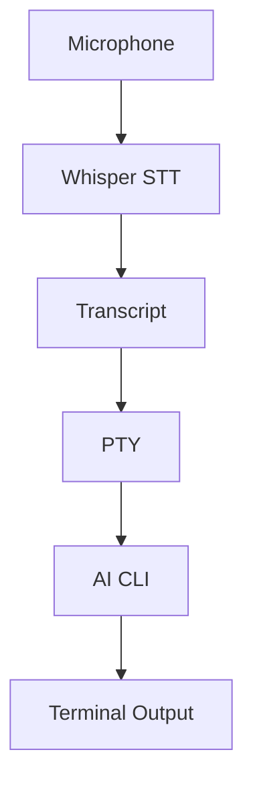

# VoxTerm


[](LICENSE)

[](https://github.com/jguida941/voxterm/actions/workflows/rust_ci.yml)
[](https://github.com/jguida941/voxterm/actions/workflows/mutation-testing.yml)

Voice input for AI CLIs. Talk instead of type. Runs Whisper locally with ~250ms latency. No cloud, no API keys.


## Quick Start

```bash
# Install Codex CLI (default backend)
npm install -g @openai/codex

# Install VoxTerm via Homebrew
brew tap jguida941/homebrew-voxterm
brew install voxterm

# Run it
cd ~/your-project
voxterm
```

First run downloads a Whisper model (~142 MB for base). See [Whisper docs](guides/WHISPER.md) for model options.

## How It Works



VoxTerm wraps your AI CLI in a PTY and adds voice input. You talk → Whisper transcribes locally → text gets typed into the CLI. All CLI output passes through unchanged.

## Features

| Feature | Description |
|---------|-------------|
| **Local STT** | Whisper runs on your machine - no cloud calls |
| **~250ms latency** | Fast transcription through whisper.cpp |
| **PTY passthrough** | CLI UI stays unchanged |
| **Auto-voice** | Hands-free mode - no typing needed |
| **Transcript queue** | Speak while CLI is busy, sends when ready |
| **Multiple backends** | Codex, Claude, Gemini, Aider, or custom |
| **Themes** | 6 built-in themes including Catppuccin, Dracula, Nord |

### Theme Picker (Ctrl+Y)


### Settings Menu (Ctrl+O)


### Voice Recording


## Controls

| Key | Action |
|-----|--------|
| `Ctrl+R` | Start voice recording |
| `Ctrl+V` | Toggle auto-voice (hands-free) |
| `Ctrl+T` | Toggle send mode (auto/insert) |
| `Ctrl+Y` | Theme picker |
| `Ctrl+O` | Settings menu |
| `Ctrl+]` | Mic sensitivity up |
| `Ctrl+\` | Mic sensitivity down |
| `?` | Show help |
| `Enter` | Stop recording / send prompt |
| `Ctrl+Q` | Quit |
| `Ctrl+C` | Send interrupt to CLI |

## Install Options

<details>
<summary><strong>Homebrew (recommended)</strong></summary>

```bash
brew tap jguida941/homebrew-voxterm
brew install voxterm
```
</details>

<details>
<summary><strong>From source</strong></summary>

```bash
git clone https://github.com/jguida941/voxterm.git
cd voxterm
./scripts/install.sh
```
</details>

<details>
<summary><strong>macOS App</strong></summary>

Double-click `app/macos/VoxTerm.app`, pick a folder, it opens Terminal with VoxTerm running.


</details>

**Requirements:** macOS or Linux (Windows needs WSL2) • Microphone access • ~1.5 GB disk for Whisper model

## Supported AI CLIs

VoxTerm works with any terminal-based AI CLI. Install your preferred CLI, then run VoxTerm with `--backend`.

### Codex (default)

```bash
npm install -g @openai/codex
voxterm
```

### Claude Code

```bash
curl -fsSL https://claude.ai/install.sh | bash
voxterm --claude
```


### Gemini CLI (not yet supported)

```bash
npm install -g @google/gemini-cli
voxterm --gemini
```

**Note:** Gemini CLI is not currently supported due to UI conflicts. We're actively working on it.

### Other CLIs

```bash
# Any CLI that accepts text input
voxterm --backend "my-cli --flag"
```

**Note:** VoxTerm should work with most terminal-based AI CLIs - just pass the command via `--backend`.

## Documentation

| Users | Developers |
|-------|------------|
| [Quick Start](QUICK_START.md) | [Development](dev/DEVELOPMENT.md) |
| [Install Guide](guides/INSTALL.md) | [Architecture](dev/ARCHITECTURE.md) |
| [Usage Guide](guides/USAGE.md) | [ADRs](dev/adr/README.md) |
| [CLI Flags](guides/CLI_FLAGS.md) | [Contributing](.github/CONTRIBUTING.md) |
| [Whisper & Languages](guides/WHISPER.md) | [Changelog](dev/CHANGELOG.md) |
| [Troubleshooting](guides/TROUBLESHOOTING.md) | |

## Contributing

PRs welcome. See [CONTRIBUTING.md](.github/CONTRIBUTING.md).

Issues: [github.com/jguida941/voxterm/issues](https://github.com/jguida941/voxterm/issues)

## License

MIT - [LICENSE](LICENSE)
