# VoxTerm (Rust Overlay) Architecture

This document describes the Rust-only overlay mode. It runs the selected backend CLI
(Codex or Claude Code) in a PTY and adds voice capture + a minimal status
overlay without touching the native UI.

## Contents

- [Goals](#goals)
- [Architecture Decision Records (ADRs)](#architecture-decision-records-adrs)
- [System Overview (Rust Only)](#system-overview-rust-only)
- [Components](#components)
- [Threads and Channels](#threads-and-channels)
- [Startup Sequence](#startup-sequence)
- [Core Flows](#core-flows)
- [Operational Workflows (Dev/CI/Release)](#operational-workflows-devcirelease)
- [Overlay State Machine](#overlay-state-machine)
- [Whisper Integration (Rust)](#whisper-integration-rust)
- [Voice Error and Fallback Flow](#voice-error-and-fallback-flow)
- [Logging and privacy](#logging-and-privacy)
- [STT behavior (non-streaming)](#stt-behavior-non-streaming)
- [Audio device behavior](#audio-device-behavior)
- [Timing and Latency](#timing-and-latency)
- [Safety and External Dependencies](#safety-and-external-dependencies)
- [Resource Lifecycle](#resource-lifecycle)
- [Prompt Detection (Auto-Voice)](#prompt-detection-auto-voice)
- [PTY Handling and Resize](#pty-handling-and-resize)
- [Output Serialization](#output-serialization)
- [Key Files](#key-files)
- [Config Knobs](#config-knobs)
- [Debugging and Logs](#debugging-and-logs)

## Goals

- Preserve the **full CLI TUI** (raw ANSI passthrough).
- Add **voice capture** and **auto-voice** without corrupting terminal output.
- Keep a **minimal overlay** (bottom status line + optional help overlay) and avoid a full-screen custom UI.

## Supported Backends

| Backend | Flag | Status | Notes |
|---------|------|--------|-------|
| Codex | `voxterm` (default) | Tested | Full support |
| Claude Code | `voxterm --claude` | Tested | Full support |
| Gemini CLI | `voxterm --gemini` | Experimental | Currently not working |
| Aider | `voxterm --backend aider` | Experimental | Untested |
| OpenCode | `voxterm --backend opencode` | Experimental | Untested |

**Primary supported backends:** Codex and Claude Code.

Backend selection is handled by `src/src/backend/` which provides preset configurations for Codex and Claude.
Additional presets (Gemini, Aider, OpenCode) exist but are experimental and not part of the primary support matrix.
Gemini is currently nonfunctional, and Aider/OpenCode are untested.

## Naming Conventions

- Use `backend`/`provider` for generic, multi-backend functionality.
- Use `codex`/`claude`/`gemini` only for provider-specific code and assets.
- The overlay binary lives under `src/src/bin/voxterm/` (name matches the shipped binary).
- Legacy names that are Codex-specific but generic in purpose were migrated under Track G in
  `dev/archive/2026-02-06-modularization-plan.md`.

## Architecture Decision Records (ADRs)

We track key decisions in ADRs so the rationale stays visible over time. See
`dev/adr/README.md` for the index, process, and template.

## System Overview (Rust Only)

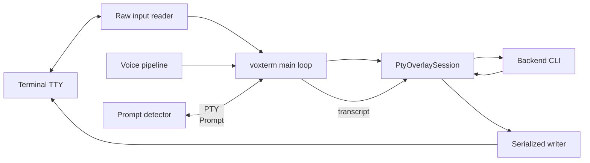

What this means:
- The **terminal is the frontend**; the overlay doesn't replace the backend's UI.
- The overlay **injects transcripts** as if typed by the user.
- The status line is drawn at the bottom using ANSI save/restore.

## Components

| Component | Path | Purpose |
|-----------|------|---------|
| Rust Overlay | `src/src/bin/voxterm/main.rs` | PTY passthrough UI with voice overlay |
| Voice Pipeline | `src/src/voice.rs` | Audio capture orchestration + STT |
| PTY Session | `src/src/pty_session/` | Raw PTY passthrough and prompt-safe output |
| IPC Mode | `src/src/ipc/` | JSON IPC integration mode |
| Auth Helpers | `src/src/auth.rs` | Backend authentication helpers |
| Diagnostics | `src/src/doctor.rs` | `--doctor` environment report |
| Terminal Restore | `src/src/terminal_restore.rs` | Panic-safe terminal cleanup |
| Telemetry | `src/src/telemetry.rs` | Structured trace logging |
| Python fallback | `scripts/python_fallback.py` | Optional fallback STT pipeline |

## Threads and Channels

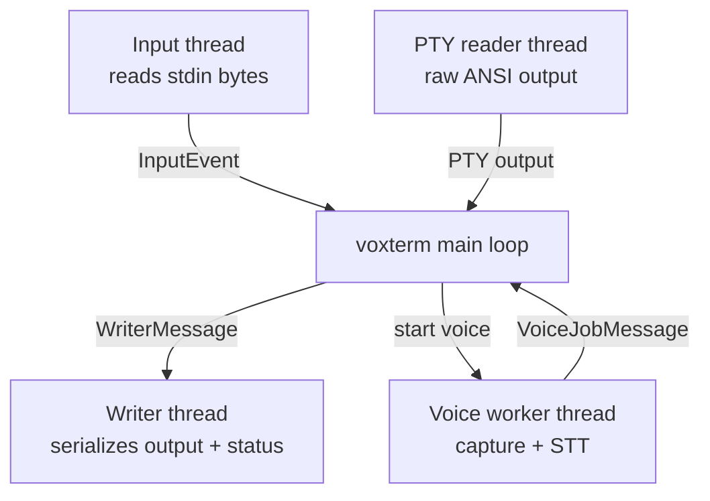

Why this matters:
- **Input thread** intercepts overlay hotkeys (voice, send mode, theme picker, help, sensitivity, exit) without blocking the backend CLI.
- **PTY reader** keeps ANSI intact while replying to terminal queries (DSR/DA).
- **Writer thread** prevents output + status/help overlay interleaving.
- **Voice thread** keeps audio/Whisper work off the main loop.

## Startup Sequence

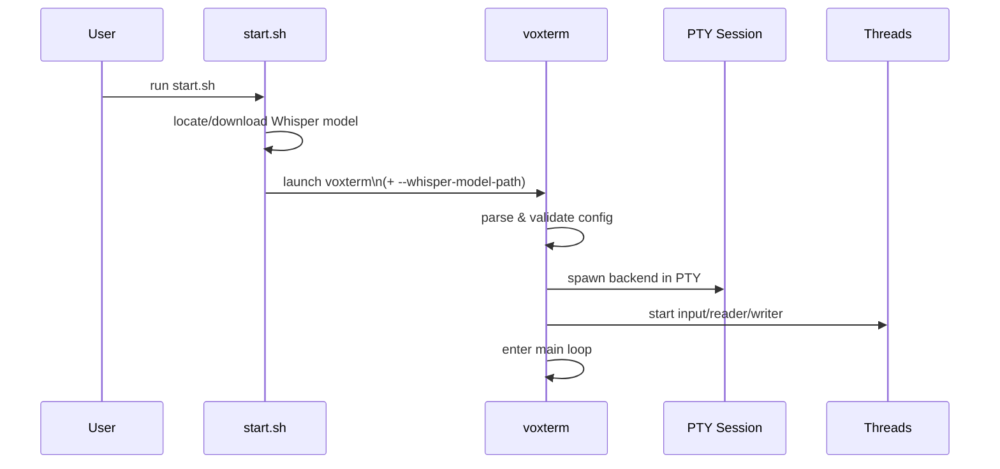

## Core Flows

### 1) Keyboard -> Backend -> Terminal

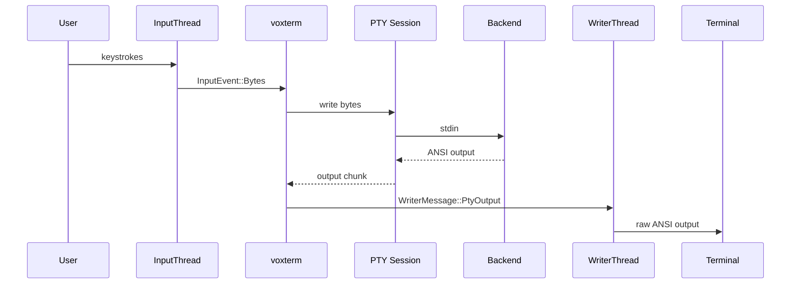

### 2) Voice -> Whisper -> Transcript -> Backend

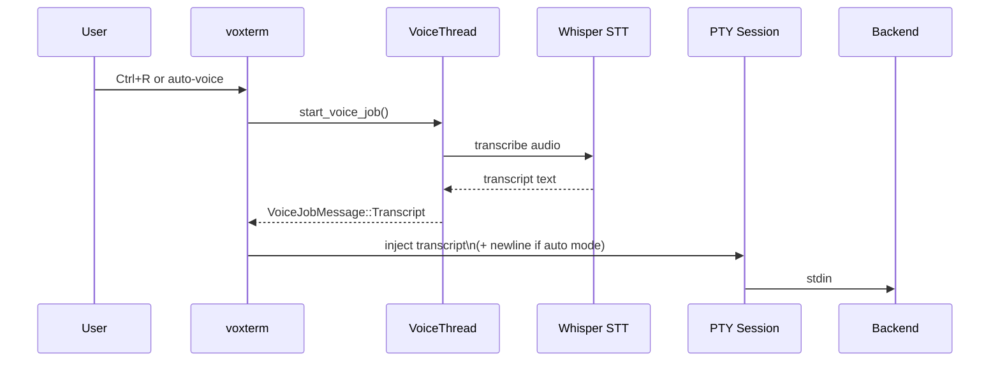

### 3) Auto-Voice (Prompt Detection)

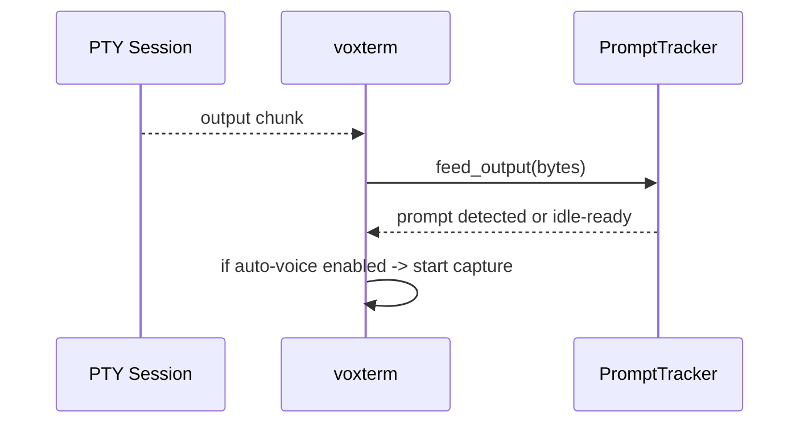

### 4) Transcript Queue + Send Modes

When the CLI is busy (output streaming), transcripts are queued and sent once the next
prompt appears or the transcript idle timer fires. Send mode controls whether a newline
is added automatically.

- Before queue/send, transcripts pass through project voice-macro expansion from
  `.voxterm/macros.yaml` (if present).
- Voice intent mode (`Command` / `Dictation`) gates that transform:
  - `Command`: macro expansion enabled.
  - `Dictation`: macro expansion disabled (raw transcript injection).
- **Auto send**: inject transcript + newline immediately when safe to send.
- **Insert**: inject transcript only (no newline); user presses Enter to send.
- **Enter while recording (insert mode)**: stops capture early and transcribes what was recorded.

## Operational Workflows (Dev/CI/Release)

This section documents engineering workflows that keep runtime behavior and release quality stable.
When workflow mechanics change (dev loop, CI lanes, release flow), update this section in the same change.

### 1) Local Feature Workflow

1. Link work in `dev/active/MASTER_PLAN.md`.
2. Implement code + tests in one change.
3. Run local verification (`python3 dev/scripts/devctl.py check --profile ci` minimum).
4. For latency-sensitive work, also run `./dev/scripts/tests/measure_latency.sh --ci-guard`.
5. Update docs (`dev/CHANGELOG.md` for user-facing changes, plus related guides/dev docs).
6. Run governance hygiene audit (`python3 dev/scripts/devctl.py hygiene`) for archive/ADR/scripts sync.

Primary command entrypoint: `dev/scripts/devctl.py`.

### 2) CI Workflow Lanes

| Workflow | File | Purpose |
|---|---|---|
| Rust CI | `.github/workflows/rust_ci.yml` | fmt + clippy + workspace tests |
| Perf Smoke | `.github/workflows/perf_smoke.yml` | validate `voice_metrics|...` logging contract |
| Latency Guardrails | `.github/workflows/latency_guard.yml` | synthetic latency regression checks (`measure_latency.sh --ci-guard`) |
| Memory Guard | `.github/workflows/memory_guard.yml` | repeated thread/resource cleanup test |
| Mutation Testing | `.github/workflows/mutation-testing.yml` | scheduled mutation score enforcement |

### 3) Release Workflow (Master Branch)

1. Finalize release metadata (`src/Cargo.toml`, `dev/CHANGELOG.md`).
2. Verify release scope (at least CI-profile checks; release profile when needed).
3. Promote/push from `master`, tag (`vX.Y.Z`), publish GitHub release.
4. Update Homebrew tap via `./dev/scripts/update-homebrew.sh <version>`.
5. Sync release snapshot in `dev/active/MASTER_PLAN.md`.

## Overlay State Machine

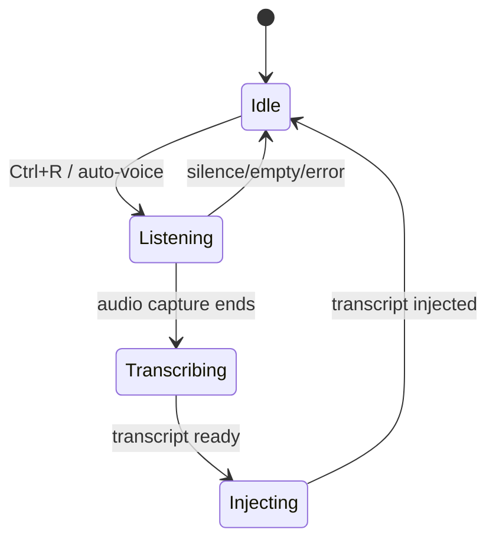

## Whisper Integration (Rust)

- **Primary path:** `stt::Transcriber` uses `whisper-rs` with a GGML model resolved
  from `--whisper-model-path` or auto-discovered from `--whisper-model` (default `small`)
  in the repo `whisper_models/` directory.
- **Fallback:** if native capture is unavailable or fails, the code falls back to Python
  (`scripts/python_fallback.py`) unless `--no-python-fallback` is set.

Common setup path:
- `./scripts/setup.sh models --base` downloads `whisper_models/ggml-base.en.bin`.
- `start.sh` passes `--whisper-model-path` into `voxterm` when a model is found.

## Voice Error and Fallback Flow

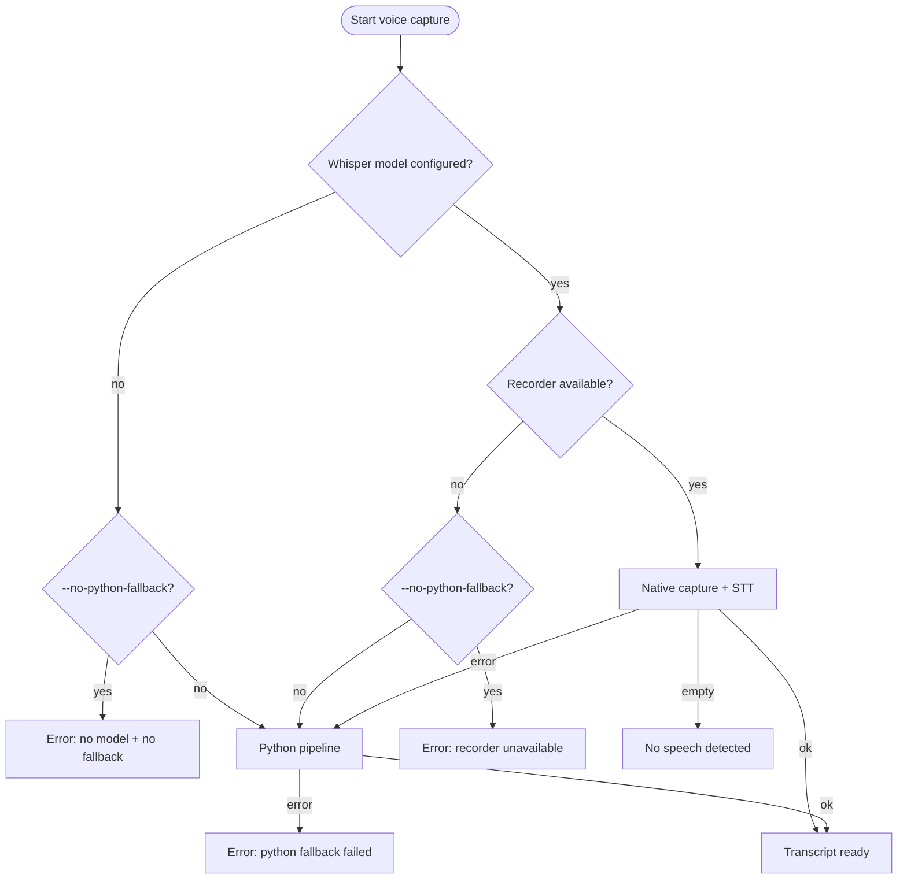

Notes:
- Python fallback requires `python3`, `ffmpeg`, and the `whisper` CLI on PATH.
- Use `--no-python-fallback` to force native Whisper and surface errors early.
- When fallback is active, the overlay tags recordings with `REC PY` and status messages report "Python"; logs record the switch.

## Logging and privacy

- File logs are opt-in: `--logs` (add `--log-content` to include prompt/transcript snippets).
- Debug logs rotate to avoid unbounded growth.
- Structured trace logs (JSON) write to the temp dir when logging is enabled (override with `VOXTERM_TRACE_LOG`).
- Prompt detection logs are opt-in via `--prompt-log` or `VOXTERM_PROMPT_LOG` (disabled by `--no-logs`).

## STT behavior (non-streaming)

- Transcription is non-streaming: each capture is fully recorded before Whisper runs.
- There is no chunk overlap; latency scales with capture length and model size.

## Audio device behavior

- The input device is chosen at startup.
- Device hotplug/recovery is not implemented; if the mic disconnects, restart or pick another device.

## Timing and Latency

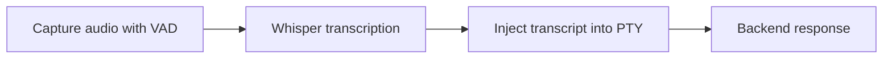

Timing observability:
- Voice capture logs: `voice_metrics|capture_ms=...|speech_ms=...|...`
- If `--log-timings` is set, also logs:
  `timing|phase=voice_capture|record_s=...|stt_s=...|chars=...`

## Safety and External Dependencies

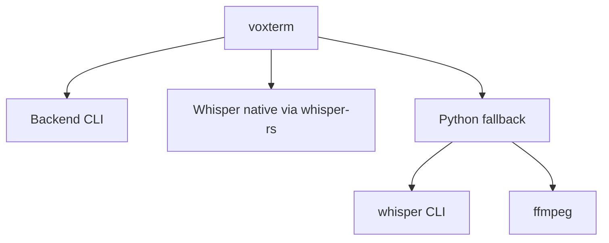

Safety constraints in code:
- CLI binary paths are validated (`--codex-cmd`, `--python-cmd`, `--ffmpeg-cmd`, `--whisper-cmd`).
- `--ffmpeg-device` is restricted to avoid shell metacharacters.
- `--whisper-model-path` must exist and is canonicalized.
- Overlay only intercepts control hotkeys; all other bytes go directly to the backend CLI.

## Resource Lifecycle

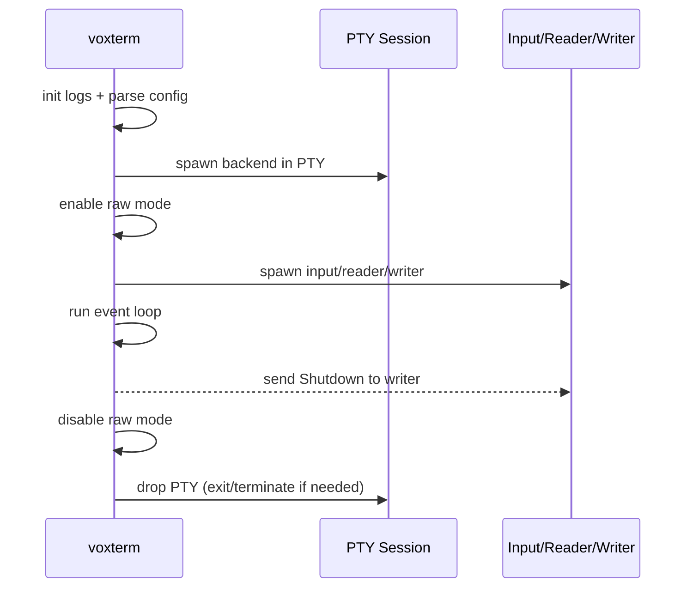

## Prompt Detection (Auto-Voice)

- Strip ANSI escape sequences from PTY output.
- Track the current line + last completed line.
- If a regex is provided (`--prompt-regex`), match against it.
- Otherwise, **learn** the prompt from the first idle line and match it later.
- Fallback: if no prompt is known, trigger auto-voice after an idle timeout.

## PTY Handling and Resize

- `PtyOverlaySession` uses `openpty` and forks the backend CLI into the slave PTY.
- It **replies to terminal queries** (DSR/DA) but leaves all ANSI intact.
- On SIGWINCH, `ioctl(TIOCSWINSZ)` updates the PTY size and forwards SIGWINCH to the backend CLI.

## Output Serialization

All terminal output is serialized through one writer thread to avoid
interleaving PTY output with the status line or help overlay. The status line
and overlay use ANSI save/restore (`ESC 7` / `ESC 8`) and redraw only after
quiet output intervals to avoid corrupting the backend's screen.

## Visual System (Overlay)

- **Enhanced status line** is driven by `StatusLineState` (mode, pipeline, sensitivity, message, duration).
- **Theme selection** uses `--theme` with automatic fallback based on terminal color capability and `NO_COLOR`.
- **Help overlay** is toggled with `?` and rendered by the writer thread above the status line.
- **Mic meter output** (`--mic-meter`) renders a bar display for ambient/speech levels.
- **Session summary** prints on exit when activity is present.

## Key Files

- `src/src/bin/voxterm/main.rs` - main loop, input handling, prompt detection (binary: `voxterm`)
- `src/src/bin/voxterm/event_loop.rs` - event loop execution and input/output handling
- `src/src/bin/voxterm/event_state.rs` - event loop state, deps, and timers shared by the main loop
- `src/src/bin/voxterm/banner.rs` - startup splash + banner configuration
- `src/src/bin/voxterm/terminal.rs` - terminal sizing, modes, and signal handling
- `src/src/bin/voxterm/arrow_keys.rs` - arrow key normalization helpers
- `src/src/bin/voxterm/progress.rs` - progress/ETA helpers for long-running tasks
- `src/src/bin/voxterm/writer/` - serialized output, status line, help overlay
- `src/src/bin/voxterm/writer/state.rs` - writer state + message handling
- `src/src/bin/voxterm/writer/render.rs` - status/overlay rendering + clear helpers
- `src/src/bin/voxterm/writer/mouse.rs` - mouse enable/disable output
- `src/src/bin/voxterm/writer/sanitize.rs` - status text sanitization + truncation
- `src/src/bin/voxterm/status_line/` - status line layout + formatting modules
- `src/src/bin/voxterm/status_line/format.rs` - status banner/line formatting
- `src/src/bin/voxterm/status_line/buttons.rs` - button layout + click positions
- `src/src/bin/voxterm/status_line/layout.rs` - breakpoints + banner height
- `src/src/bin/voxterm/status_line/animation.rs` - status animation helpers
- `src/src/bin/voxterm/status_line/state.rs` - status line state enums + structs
- `src/src/bin/voxterm/status_line/text.rs` - display width + truncation helpers
- `src/src/bin/voxterm/status_style.rs` - status message categorization + styling
- `src/src/bin/voxterm/hud/` - HUD modules (ribbon/dots/heartbeat/latency)
- `src/src/bin/voxterm/icons.rs` - status line icons/glyphs
- `src/src/bin/voxterm/color_mode.rs` - color mode detection + overrides
- `src/src/bin/voxterm/theme/` - color palettes and theme selection
- `src/src/bin/voxterm/theme_ops.rs` - theme picker selection + theme cycling helpers
- `src/src/bin/voxterm/theme_picker.rs` - interactive theme picker overlay
- `src/src/bin/voxterm/help.rs` - shortcut help overlay rendering
- `src/src/bin/voxterm/overlays.rs` - overlay rendering helpers
- `src/src/bin/voxterm/prompt/` - prompt detection + logging modules
- `src/src/bin/voxterm/prompt/tracker.rs` - prompt tracking + idle detection
- `src/src/bin/voxterm/prompt/regex.rs` - prompt regex resolution
- `src/src/bin/voxterm/prompt/logger.rs` - prompt log writer + rotation
- `src/src/bin/voxterm/prompt/strip.rs` - ANSI stripping for prompt matching
- `src/src/bin/voxterm/voice_control/` - voice capture manager + drain logic
- `src/src/bin/voxterm/voice_control/manager.rs` - voice capture lifecycle + start helpers
- `src/src/bin/voxterm/voice_control/drain.rs` - voice job handling + transcript delivery
- `src/src/bin/voxterm/voice_control/pipeline.rs` - pipeline selection helpers
- `src/src/bin/voxterm/voice_macros.rs` - project macro loader + transcript trigger expansion
- `src/src/bin/voxterm/transcript/` - transcript queue + delivery helpers
- `src/src/bin/voxterm/session_stats.rs` - session counters + summary output
- `src/src/bin/voxterm/cli_utils.rs` - CLI helper utilities
- `src/src/bin/voxterm/input/` - input parsing + event mapping
- `src/src/bin/voxterm/input/event.rs` - input event enum
- `src/src/bin/voxterm/input/parser.rs` - input parser + CSI handling
- `src/src/bin/voxterm/input/mouse.rs` - SGR mouse parsing
- `src/src/bin/voxterm/input/spawn.rs` - input thread loop
- `src/src/bin/voxterm/config/` - overlay CLI config + backend resolution
- `src/src/bin/voxterm/config/cli.rs` - overlay CLI flags + enums
- `src/src/bin/voxterm/config/backend.rs` - backend resolution + prompt patterns
- `src/src/bin/voxterm/config/theme.rs` - theme/color-mode resolution
- `src/src/bin/voxterm/config/util.rs` - backend command helpers
- `src/src/bin/voxterm/settings_handlers.rs` - settings actions + toggles
- `src/src/bin/voxterm/settings/` - settings overlay layout + menu state
- `src/src/bin/voxterm/buttons.rs` - HUD button layout + registry
- `src/src/bin/voxterm/button_handlers.rs` - HUD button registry + action handling
- `src/src/bin/voxterm/audio_meter/` - mic meter visuals (`--mic-meter`)
- `src/src/backend/` - provider registry + backend presets (Codex/Claude/Gemini/etc.)
- `src/src/codex/` - Codex CLI runtime (CodexJobRunner + CodexCliBackend)
- `src/src/legacy_tui/` - Codex-specific TUI state + logging (legacy path)
- `src/src/legacy_ui.rs` - Codex-specific TUI renderer (legacy path)
- `src/src/pty_session/` - raw PTY passthrough + query replies
- `src/src/voice.rs` - voice capture job orchestration
- `src/src/audio/` - CPAL recorder + VAD
- `src/src/stt.rs` - Whisper transcription
- `src/src/config/` - CLI flags + validation
- `src/src/ipc/` - JSON IPC session loop
- `src/src/auth.rs` - backend auth helpers
- `src/src/doctor.rs` - diagnostics report
- `src/src/telemetry.rs` - tracing/JSON logs
- `src/src/terminal_restore.rs` - terminal restore guard

## Other Binaries

- `src/src/bin/voice_benchmark.rs` - voice pipeline benchmark harness
- `src/src/bin/latency_measurement.rs` - latency measurement tool
- `src/src/bin/test_crash.rs` - crash logger test binary
- `src/src/bin/test_utf8_bug.rs` - UTF-8 regression test binary

## Cargo Features

- `high-quality-audio` (default): enables high-quality resampling via `rubato`
- `vad_earshot` (default): enables the Earshot VAD backend
- `mutants`: test-only hooks for mutation testing

## Config Knobs

Full CLI reference: `guides/CLI_FLAGS.md`.

**Overlay Flags**
| Flag | Purpose |
|------|---------|
| `--backend <NAME\|CMD>` | Backend preset or custom command string |
| `--codex` | Shorthand for Codex backend |
| `--claude` | Shorthand for Claude backend |
| `--gemini` | Shorthand for Gemini backend (experimental) |
| `--login` | Run backend login before starting |
| `--prompt-regex` | Override prompt detection pattern |
| `--prompt-log` | Prompt detection log path |
| `--auto-voice` | Start in auto-voice mode |
| `--auto-voice-idle-ms` | Idle timeout before auto-voice triggers |
| `--transcript-idle-ms` | Idle timeout before queued transcripts flush |
| `--voice-send-mode` | `auto` vs `insert` transcript handling |
| `--theme` | Status line theme |
| `--no-color` | Disable color output |
| `--hud-right-panel` | Right-side HUD panel selection |
| `--hud-right-panel-recording-only` | Animate right panel only while recording |
| `--hud-style` | Full/minimal/hidden HUD |
| `--minimal-hud` | Shorthand for minimal HUD |

Project-local config:
- `.voxterm/macros.yaml` (optional) defines transcript trigger expansions before PTY injection.

**Core CLI Flags**
| Flag | Purpose |
|------|---------|
| `--codex-cmd` | Codex binary path |
| `--claude-cmd` | Claude binary path |
| `--codex-arg` | Extra args for Codex (repeatable) |
| `--python-cmd` | Python interpreter for fallback scripts |
| `--pipeline-script` | Python fallback pipeline script |
| `--term` | TERM value passed to the backend CLI |
| `--input-device` | Preferred microphone |
| `--list-input-devices` | List microphones and exit |
| `--doctor` | Diagnostics report and exit |
| `--mic-meter` | Run mic calibration |
| `--mic-meter-ambient-ms` | Ambient calibration duration |
| `--mic-meter-speech-ms` | Speech calibration duration |
| `--sounds` | Enable notification sounds |
| `--sound-on-complete` | Beep on transcript completion |
| `--sound-on-error` | Beep on voice capture error |
| `--persistent-codex` | Keep a persistent Codex PTY session |
| `--logs` | Enable debug logging |
| `--no-logs` | Disable logging (overrides `--logs`) |
| `--log-content` | Allow content snippets in logs |
| `--log-timings` | Enable verbose timing logs |
| `--claude-skip-permissions` | Skip Claude IPC permission prompts |
| `--whisper-cmd` | Whisper CLI path (python fallback) |
| `--whisper-model` | Whisper model name |
| `--whisper-model-path` | Whisper model file path |
| `--whisper-beam-size` | Beam size (native pipeline) |
| `--whisper-temperature` | Sampling temperature |
| `--ffmpeg-cmd` | FFmpeg binary path |
| `--ffmpeg-device` | FFmpeg input device override |
| `--seconds` | Fallback recording duration |
| `--voice-sample-rate` | Audio sample rate |
| `--voice-max-capture-ms` | Max capture duration |
| `--voice-silence-tail-ms` | Trailing silence to stop capture |
| `--voice-min-speech-ms-before-stt` | Minimum speech before STT |
| `--voice-lookback-ms` | Audio retained before silence stop |
| `--voice-buffer-ms` | Audio buffer budget |
| `--voice-channel-capacity` | Frame channel capacity |
| `--voice-stt-timeout-ms` | STT timeout before fallback |
| `--voice-vad-threshold-db` | VAD sensitivity threshold |
| `--voice-vad-frame-ms` | VAD frame size |
| `--voice-vad-smoothing-frames` | VAD smoothing window |
| `--voice-vad-engine` | VAD implementation |
| `--lang` | Whisper language code |
| `--no-python-fallback` | Disable python STT fallback |
| `--json-ipc` | JSON IPC mode |

**Environment Variables**
| Variable | Purpose |
|----------|---------|
| `VOXTERM_CWD` | Run backend CLI in a chosen directory |
| `VOXTERM_MODEL_DIR` | Whisper model storage path (install/start scripts) |
| `VOXTERM_INSTALL_DIR` | Override install location |
| `VOXTERM_NO_STARTUP_BANNER` | Skip startup splash |
| `VOXTERM_PROMPT_REGEX` | Override prompt detection |
| `VOXTERM_PROMPT_LOG` | Prompt detection log path |
| `VOXTERM_LOGS` | Enable logging (same as `--logs`) |
| `VOXTERM_NO_LOGS` | Disable logging |
| `VOXTERM_LOG_CONTENT` | Allow content in logs |
| `VOXTERM_TRACE_LOG` | Structured trace log path |
| `CLAUDE_CMD` | Override Claude CLI path |
| `VOXTERM_PROVIDER` | IPC default provider |
| `NO_COLOR` | Standard color disable flag |

## Debugging and Logs

- Logs are opt-in: enable with `--logs` (add `--log-content` for prompt/transcript snippets).
- Debug log: `${TMPDIR}/voxterm_tui.log` (created only when logs are enabled).
- Trace log (JSON): `${TMPDIR}/voxterm_trace.jsonl` (override with `VOXTERM_TRACE_LOG`).
- Prompt detection log: only when `--prompt-log` or `VOXTERM_PROMPT_LOG` is set.
- Use `--no-python-fallback` to force native Whisper and surface errors early.
