# VoxTerm (Rust Overlay) Architecture

This document describes the Rust-only overlay mode. It runs the Codex CLI (or another
AI CLI selected via `--backend`) in a PTY and adds voice capture + a minimal status
overlay without touching the native UI.

## Contents

- [Goals](#goals)
- [Architecture Decision Records (ADRs)](#architecture-decision-records-adrs)
- [System Overview (Rust Only)](#system-overview-rust-only)
- [Components](#components)
- [Threads and Channels](#threads-and-channels)
- [Startup Sequence](#startup-sequence)
- [Core Flows](#core-flows)
- [Overlay State Machine](#overlay-state-machine)
- [Whisper Integration (Rust)](#whisper-integration-rust)
- [Voice Error and Fallback Flow](#voice-error-and-fallback-flow)
- [Logging and privacy](#logging-and-privacy)
- [STT behavior (non-streaming)](#stt-behavior-non-streaming)
- [Audio device behavior](#audio-device-behavior)
- [Timing and Latency](#timing-and-latency)
- [Safety and External Dependencies](#safety-and-external-dependencies)
- [Resource Lifecycle](#resource-lifecycle)
- [Prompt Detection (Auto-Voice)](#prompt-detection-auto-voice)
- [PTY Handling and Resize](#pty-handling-and-resize)
- [Output Serialization](#output-serialization)
- [Key Files](#key-files)
- [Config Knobs](#config-knobs)
- [Debugging and Logs](#debugging-and-logs)

## Goals

- Preserve the **full Codex TUI** (raw ANSI passthrough).
- Add **voice capture** and **auto-voice** without corrupting terminal output.
- Keep a **minimal overlay** (bottom status line + optional help overlay) and avoid a full-screen custom UI.

## Architecture Decision Records (ADRs)

We track key decisions in ADRs so the rationale stays visible over time. See
`docs/dev/adr/README.md` for the index, process, and template.

## System Overview (Rust Only)

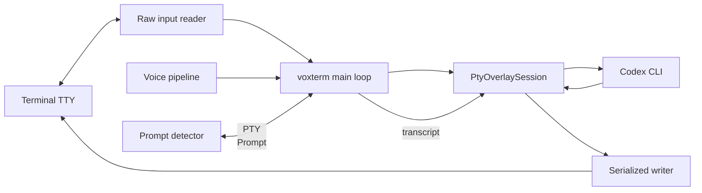

What this means:
- The **terminal is the frontend**; the overlay doesn't replace Codex's UI.
- The overlay **injects transcripts** as if typed by the user.
- The status line is drawn at the bottom using ANSI save/restore.

## Components

| Component | Path | Purpose |
|-----------|------|---------|
| Rust Overlay | `rust_tui/src/bin/codex_overlay/main.rs` | PTY passthrough UI with voice overlay |
| Voice Pipeline | `rust_tui/src/voice.rs` | Audio capture orchestration + STT |
| PTY Session | `rust_tui/src/pty_session/` | Raw PTY passthrough and prompt-safe output |
| Python fallback | `scripts/voxterm.py` | Optional fallback STT pipeline |

## Threads and Channels

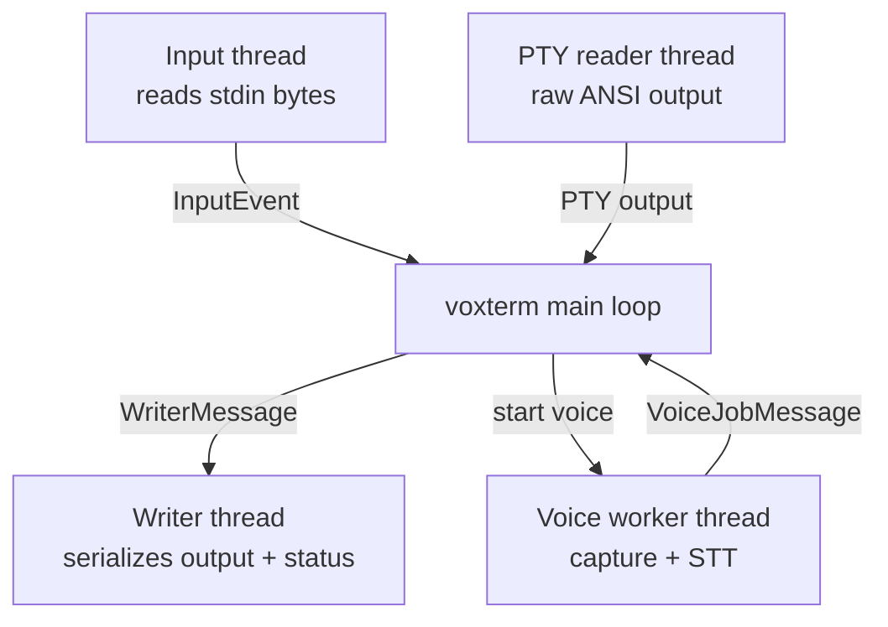

Why this matters:
- **Input thread** intercepts overlay hotkeys (voice, send mode, theme picker, help, sensitivity, exit) without blocking Codex.
- **PTY reader** keeps ANSI intact while replying to terminal queries (DSR/DA).
- **Writer thread** prevents output + status/help overlay interleaving.
- **Voice thread** keeps audio/Whisper work off the main loop.

## Startup Sequence

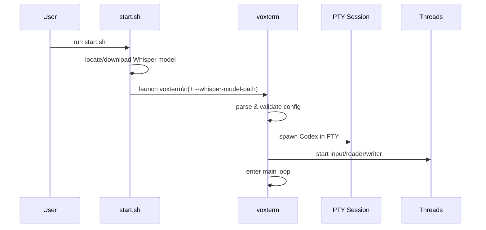

## Core Flows

### 1) Keyboard -> Codex -> Terminal

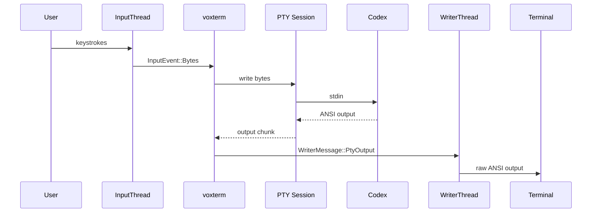

### 2) Voice -> Whisper -> Transcript -> Codex

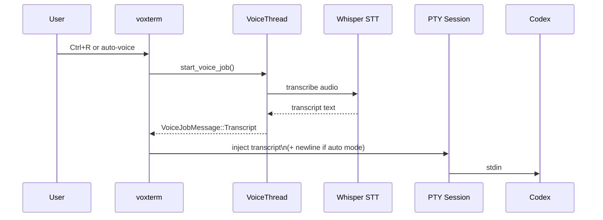

### 3) Auto-Voice (Prompt Detection)

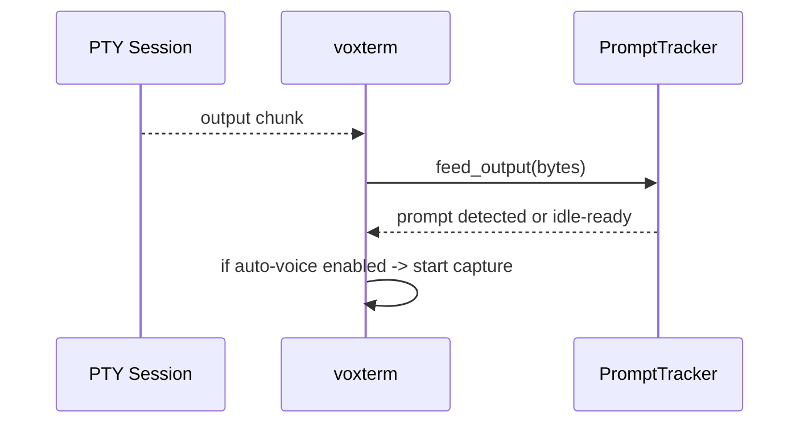

## Overlay State Machine

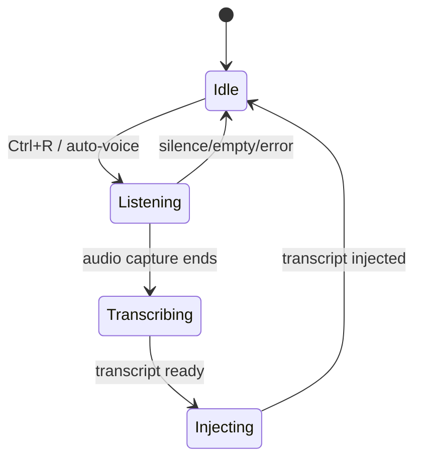

## Whisper Integration (Rust)

- **Primary path:** `stt::Transcriber` uses `whisper-rs` with a GGML model resolved
  from `--whisper-model-path` or auto-discovered from `--whisper-model` (default `small`)
  in the repo `models/` directory.
- **Fallback:** if native capture is unavailable or fails, the code falls back to Python
  (`scripts/voxterm.py`) unless `--no-python-fallback` is set.

Common setup path:
- `./scripts/setup.sh models --base` downloads `models/ggml-base.en.bin`.
- `start.sh` passes `--whisper-model-path` into `voxterm` when a model is found.

## Voice Error and Fallback Flow

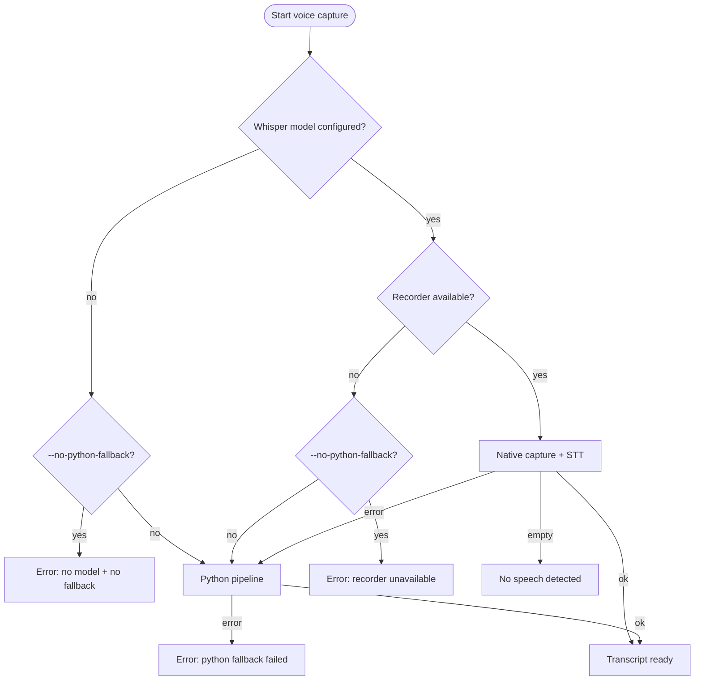

Notes:
- Python fallback requires `python3`, `ffmpeg`, and the `whisper` CLI on PATH.
- Use `--no-python-fallback` to force native Whisper and surface errors early.
- When fallback is active, the overlay tags recordings with `REC PY` and status messages report "Python"; logs record the switch.

## Logging and privacy

- File logs are opt-in: `--logs` (add `--log-content` to include prompt/transcript snippets).
- Debug logs rotate to avoid unbounded growth.
- Prompt detection logs are opt-in via `--prompt-log` or `VOXTERM_PROMPT_LOG` (disabled by `--no-logs`).

## STT behavior (non-streaming)

- Transcription is non-streaming: each capture is fully recorded before Whisper runs.
- There is no chunk overlap; latency scales with capture length and model size.

## Audio device behavior

- The input device is chosen at startup.
- Device hotplug/recovery is not implemented; if the mic disconnects, restart or pick another device.

## Timing and Latency

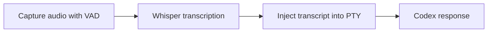

Timing observability:
- Voice capture logs: `voice_metrics|capture_ms=...|speech_ms=...|...`
- If `--log-timings` is set, also logs:
  `timing|phase=voice_capture|record_s=...|stt_s=...|chars=...`

## Safety and External Dependencies

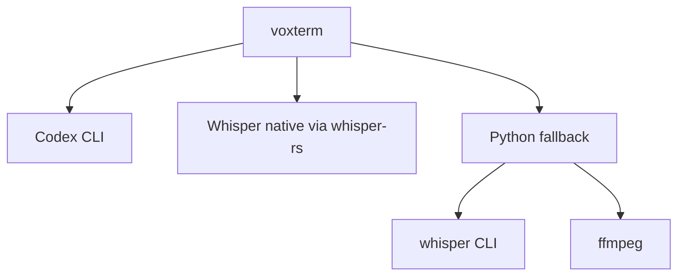

Safety constraints in code:
- CLI binary paths are validated (`--codex-cmd`, `--python-cmd`, `--ffmpeg-cmd`, `--whisper-cmd`).
- `--ffmpeg-device` is restricted to avoid shell metacharacters.
- `--whisper-model-path` must exist and is canonicalized.
- Overlay only intercepts control hotkeys; all other bytes go directly to Codex.

## Resource Lifecycle

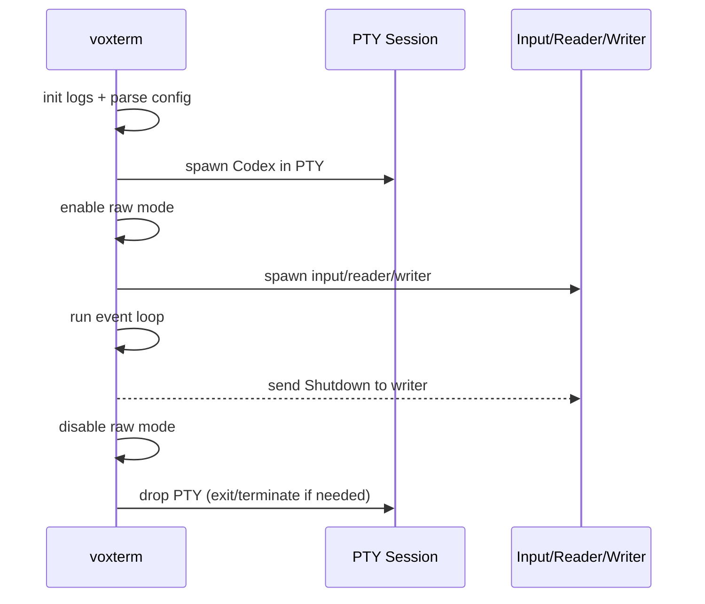

## Prompt Detection (Auto-Voice)

- Strip ANSI escape sequences from PTY output.
- Track the current line + last completed line.
- If a regex is provided (`--prompt-regex`), match against it.
- Otherwise, **learn** the prompt from the first idle line and match it later.
- Fallback: if no prompt is known, trigger auto-voice after an idle timeout.

## PTY Handling and Resize

- `PtyOverlaySession` uses `openpty` and forks Codex into the slave PTY.
- It **replies to terminal queries** (DSR/DA) but leaves all ANSI intact.
- On SIGWINCH, `ioctl(TIOCSWINSZ)` updates the PTY size and forwards SIGWINCH to Codex.

## Output Serialization

All terminal output is serialized through one writer thread to avoid
interleaving PTY output with the status line or help overlay. The status line
and overlay use ANSI save/restore (`ESC 7` / `ESC 8`) and redraw only after
quiet output intervals to avoid corrupting Codex's screen.

## Visual System (Overlay)

- **Enhanced status line** is driven by `StatusLineState` (mode, pipeline, sensitivity, message, duration).
- **Theme selection** uses `--theme` with automatic fallback based on terminal color capability and `NO_COLOR`.
- **Help overlay** is toggled with `?` and rendered by the writer thread above the status line.
- **Mic meter output** (`--mic-meter`) renders a bar display for ambient/speech levels.
- **Session summary** prints on exit when activity is present.

Design details and audit notes live in `docs/active/UI_ENHANCEMENT_PLAN.md`.

## Key Files

- `rust_tui/src/bin/codex_overlay/main.rs` - main loop, input handling, prompt detection (binary: `voxterm`)
- `rust_tui/src/bin/codex_overlay/writer.rs` - serialized output, status line, help overlay
- `rust_tui/src/bin/codex_overlay/status_line.rs` - status line layout + formatting
- `rust_tui/src/bin/codex_overlay/status_style.rs` - status message categorization + styling
- `rust_tui/src/bin/codex_overlay/theme.rs` - color palettes and theme selection
- `rust_tui/src/bin/codex_overlay/help.rs` - shortcut help overlay rendering
- `rust_tui/src/bin/codex_overlay/audio_meter.rs` - mic meter visuals (`--mic-meter`)
- `rust_tui/src/pty_session/` - raw PTY passthrough + query replies
- `rust_tui/src/voice.rs` - voice capture job orchestration
- `rust_tui/src/audio/` - CPAL recorder + VAD
- `rust_tui/src/stt.rs` - Whisper transcription
- `rust_tui/src/config/` - CLI flags + validation

## Config Knobs

- `--whisper-model-path` - load native Whisper model
- `--voice-send-mode auto|insert` - auto-send transcript or insert for editing
- `--auto-voice` - enable auto mode on startup
- `--auto-voice-idle-ms` - idle timeout before auto-voice triggers
- `--theme` / `--no-color` - status line theme selection and color disable
- `--mic-meter` - run mic calibration with visual meter output
- `--mic-meter-ambient-ms` / `--mic-meter-speech-ms` - calibration sample durations
- `--prompt-regex` - override prompt detection
- `VOXTERM_CWD` - run Codex in a chosen project directory

## Debugging and Logs

- Logs are opt-in: enable with `--logs` (add `--log-content` for prompt/transcript snippets).
- Debug log: `${TMPDIR}/voxterm_tui.log` (created only when logs are enabled).
- Prompt detection log: only when `--prompt-log` or `VOXTERM_PROMPT_LOG` is set.
- Use `--no-python-fallback` to force native Whisper and surface errors early.
