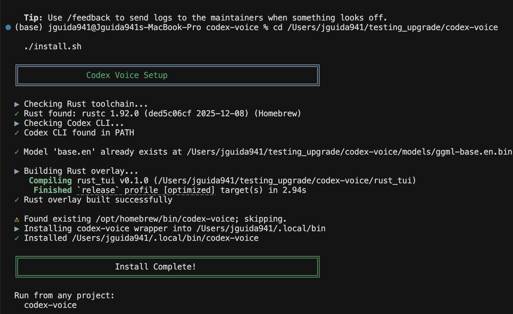
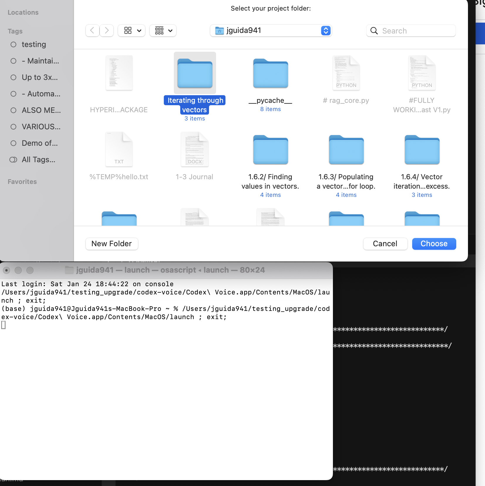

# Installation

This doc covers install options and model setup.
Recommended: Homebrew on macOS/Linux for a global `voxterm` command.

## Platform Support

| Platform | Status | Install Method |
|----------|--------|----------------|
| **macOS** (Intel/Apple Silicon) | ✅ Supported | Homebrew (recommended), App, Source |
| **Linux** (x86_64/arm64) | ✅ Supported | Homebrew (recommended), Source |
| **Windows** | ⚠️ WSL2 only | Use Linux instructions in WSL2 |

## Contents

- [Prerequisites](#prerequisites)
- [Option A: Homebrew (recommended)](#option-a-homebrew-recommended)
- [Option B: Install from source](#option-b-install-from-source)
- [Option C: macOS App (folder picker)](#option-c-macos-app-folder-picker)
- [Option D: Manual run (no install)](#option-d-manual-run-no-install)
- [Using with your own projects](#using-with-your-own-projects)
- [Windows](#windows)
- [See Also](#see-also)

## Prerequisites

**AI CLI (choose one):**

| CLI | Install Command |
|-----|-----------------|
| Codex (default) | `npm install -g @openai/codex` |
| Claude Code | `curl -fsSL https://claude.ai/install.sh | bash` |

Authenticate once after installing your CLI:
```bash
voxterm --login --codex
voxterm --login --claude
```

**Other requirements:**
- Microphone access
- Whisper model (GGML) downloaded on first run
- Disk space for models: `tiny.en` ~75 MB, `base.en` ~142 MB, `small.en` ~466 MB, `medium.en` ~1.5 GB, `large` ~3.1 GB
- Rust toolchain (stable) only if you build from source: https://rustup.rs
- Optional (Python fallback): `python3`, `ffmpeg`, and the `whisper` CLI on PATH
  (disable with `--no-python-fallback`)

## Option A: Homebrew (recommended)

Install Homebrew (if needed):

```bash
/bin/bash -c "$(curl -fsSL https://raw.githubusercontent.com/Homebrew/install/HEAD/install.sh)"
```

Tap and install:

```bash
brew tap jguida941/voxterm
brew install voxterm
```

Run from any project (first run downloads the model if missing):

```bash
cd ~/my-project
voxterm
```

Model storage defaults to `~/.local/share/voxterm/models` for Homebrew installs
(or when the repo directory is not writable). The install/start scripts honor
`VOXTERM_MODEL_DIR` for a custom path.

Optional pre-download:

```bash
$(brew --prefix)/opt/voxterm/libexec/scripts/setup.sh models --base
```

### Homebrew update

```bash
brew update
brew upgrade voxterm
```

If Homebrew still shows an older version or `voxterm` runs an older binary, see
[Troubleshooting: Wrong version after update](TROUBLESHOOTING.md#wrong-version-after-update).

After upgrading, run `voxterm --version` and open Settings (`Ctrl+O`) once to
confirm runtime options such as `Voice mode` and `Review first` are present.

## Option B: Install from source

Recommended if you want a local build or plan to hack on VoxTerm.

```bash
git clone https://github.com/jguida941/voxterm.git
cd voxterm
./scripts/install.sh
```

The installer builds the overlay, installs the `voxterm` wrapper, and downloads
a Whisper model to the correct path for the CLI.

To suppress the startup splash screen, set `VOXTERM_NO_STARTUP_BANNER=1`.

Example output:



To choose a model size during install:

```bash
./scripts/install.sh --tiny
./scripts/install.sh --small
./scripts/install.sh --medium
```

### PATH notes

If `voxterm` is not found, the installer used the first writable directory in
this order: `/opt/homebrew/bin`, `/usr/local/bin`, `~/.local/bin`, or
`/path/to/voxterm/bin`.

Add that directory to PATH or set `VOXTERM_INSTALL_DIR` before running
`./scripts/install.sh`.

If a `voxterm` command already exists in `/opt/homebrew/bin` or
`/usr/local/bin`, the installer skips that location to avoid clobbering
system/Homebrew installs. In `~/.local/bin` or the repo `bin/` directory it
will overwrite. Remove the conflicting binary or set `VOXTERM_INSTALL_DIR`
to override.

## Option C: macOS App (folder picker)

1. Double-click **app/macos/VoxTerm.app**.
2. Pick your project folder.
3. A Terminal window opens and runs the overlay inside that folder.



## Option D: Manual run (no install)

Run from any project folder:

```bash
VOXTERM_CWD="$(pwd)" /path/to/voxterm/scripts/start.sh
```

`scripts/start.sh` handles model download and setup when needed.

## Using with your own projects

VoxTerm works with any codebase. Run from your project directory or set
`VOXTERM_CWD` to force the working directory.

```bash
cd ~/my-project
voxterm
```

To target Claude instead of Codex:

```bash
voxterm --claude
```

## Windows

Windows native is not supported yet (the overlay uses a Unix PTY). Use WSL2 or
a macOS/Linux machine.

## See Also

| Topic | Link |
|-------|------|
| Quick Start | [QUICK_START.md](../QUICK_START.md) |
| Usage | [USAGE.md](USAGE.md) |
| CLI Flags | [CLI_FLAGS.md](CLI_FLAGS.md) |
| Troubleshooting | [TROUBLESHOOTING.md](TROUBLESHOOTING.md) |
