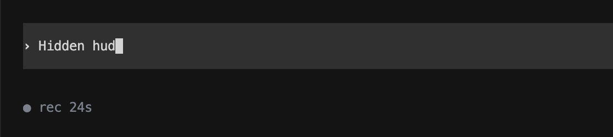

# Usage Guide

VoiceTerm is a voice-first terminal overlay for AI CLIs. It transcribes speech
locally and injects text into your terminal input.

Primary support: Codex and Claude Code.


## Contents

- [Start in 60 Seconds](#start-in-60-seconds)
- [Backend Support](#backend-support)
- [How Voice Input Works](#how-voice-input-works)
- [Core Controls](#core-controls)
- [Settings Menu](#settings-menu)
- [Voice Modes](#voice-modes)
- [Common Tasks](#common-tasks)
- [Customization](#customization)
- [Project Voice Macros](#project-voice-macros)
- [Status Line Reference](#status-line-reference)
- [Launch Recipes](#launch-recipes)
- [See Also](#see-also)

## Start in 60 Seconds

1. Launch VoiceTerm in your project folder:
   ```bash
   voiceterm
   ```
2. Press `Ctrl+R`, speak, then pause.
3. VoiceTerm transcribes and types text into the CLI input.

Default send behavior is `auto`:
- `auto`: VoiceTerm types text and presses Enter.
- `insert`: VoiceTerm types text and waits for you to press Enter.

If you have not authenticated your backend CLI yet:

```bash
voiceterm --login --codex
voiceterm --login --claude
```

## Backend Support

| Backend | Run command | Status |
|---------|-------------|--------|
| Codex | `voiceterm` or `voiceterm --codex` | Supported |
| Claude Code | `voiceterm --claude` | Supported |
| Gemini CLI | `voiceterm --gemini` | Experimental (currently not working) |
| Aider | `voiceterm --backend aider` | Experimental (untested) |
| OpenCode | `voiceterm --backend opencode` | Experimental (untested) |

## How Voice Input Works

VoiceTerm only handles voice capture and text injection. It does not replace your
backend CLI.

Flow:
1. Record: VoiceTerm listens while you speak.
2. Transcribe: local Whisper converts speech to text.
3. Expand (optional): macro rules from `.voiceterm/macros.yaml` apply if enabled.
4. Inject: final text is typed into terminal input.
5. Send decision:
   - `auto`: press Enter automatically.
   - `insert`: wait for manual Enter.


## Core Controls

| Key | Action |
|-----|--------|
| `Ctrl+R` | Start recording (manual trigger) |
| `Ctrl+V` | Toggle auto-voice |
| `Ctrl+T` | Toggle send mode (`auto` <-> `insert`) |
| `Ctrl+O` | Open settings |
| `Ctrl+Y` | Open theme picker |
| `Ctrl+U` | Cycle HUD style (Full -> Minimal -> Hidden) |
| `Ctrl+]` | Increase threshold (less sensitive mic) |
| `Ctrl+\` | Decrease threshold (more sensitive mic) |
| `Ctrl+/` | Alias for threshold down |
| `?` | Open shortcut help overlay |
| `Enter` | In `insert` mode: stop recording early, then send when ready |
| `Ctrl+C` | Forward interrupt to backend CLI |
| `Ctrl+Q` | Quit VoiceTerm |

When Mouse is enabled, HUD buttons are clickable. Keyboard HUD focus still works
with Left/Right + Enter.

## Settings Menu

Open with `Ctrl+O`.

- Navigate rows: Up/Down
- Change values: Left/Right
- Toggle/activate: Enter
- Close: Esc


Common settings:
- Auto-voice
- Send mode (`auto` or `insert`)
- Macros toggle
- Mic threshold
- Theme
- Latency display (`Off`, `Nms`, `Latency: Nms`)
- HUD style and border style
- Right panel mode and recording-only animation
- Mouse support

## Voice Modes

Three controls define runtime behavior:
- Auto-voice (`Ctrl+V`)
- Send mode (`Ctrl+T`)
- Macros toggle (Settings -> Macros)

### Auto-voice x send mode

| Auto-voice | Send mode | Behavior |
|------------|-----------|----------|
| Off | `auto` | Press `Ctrl+R` to record. Transcript is injected and sent. |
| Off | `insert` | Press `Ctrl+R` to record. Transcript is injected and waits for Enter. |
| On | `auto` | Speak when ready. Transcript is injected and sent. |
| On | `insert` | Speak when ready. Transcript is injected and waits for Enter. |

### Practical notes

- In `insert` mode, pressing Enter during recording stops capture early.
- In auto-voice mode, VoiceTerm waits for prompt readiness before listening again.
- If prompt detection is unusual, set `--prompt-regex`.

### Long dictation (`auto-voice` + `insert`)

Capture is chunked by duration (default 30s, max 60s via
`--voice-max-capture-ms`). Each chunk is transcribed and injected; press Enter
once when ready to submit.

## Common Tasks

### Adjust microphone sensitivity

- `Ctrl+]`: less sensitive (higher threshold)
- `Ctrl+\` or `Ctrl+/`: more sensitive (lower threshold)

Range:
- Hotkeys: `-80 dB` to `-10 dB`
- CLI flag: `-120 dB` to `0 dB`
- Default: `-55 dB`

Calibration helper:

```bash
voiceterm --mic-meter
```

### Check or select audio devices

```bash
voiceterm --list-input-devices
voiceterm --input-device "MacBook Pro Microphone"
```

### Run diagnostics

```bash
voiceterm --doctor
```

### Tune auto-voice timing

```bash
voiceterm --auto-voice-idle-ms 1200
voiceterm --transcript-idle-ms 250
```

### Startup splash behavior

```bash
VOICETERM_STARTUP_SPLASH_MS=0 voiceterm
VOICETERM_STARTUP_SPLASH_MS=900 voiceterm
VOICETERM_NO_STARTUP_BANNER=1 voiceterm
```

### Notification sounds

```bash
voiceterm --sounds
voiceterm --sound-on-complete
voiceterm --sound-on-error
```

## Customization

### Themes

Open theme picker with `Ctrl+Y`.


Available themes:
- `chatgpt`
- `claude`
- `codex`
- `coral`
- `catppuccin`
- `dracula`
- `nord`
- `tokyonight`
- `gruvbox`
- `ansi`
- `none`

Tips:
- Set at startup: `voiceterm --theme catppuccin`
- Disable color: `voiceterm --no-color` or `NO_COLOR=1`
- Default theme depends on backend (`codex`, `claude`, or `coral`)

### HUD styles

| Style | Flag | Summary |
|-------|------|---------|
| Full | default | Multi-row HUD with detailed controls and telemetry |
| Minimal | `--hud-style minimal` or `--minimal-hud` | Single-line strip |
| Hidden | `--hud-style hidden` | Minimal launcher row when idle |

Full HUD border style options:
- `theme`, `single`, `rounded`, `double`, `heavy`, `none`

Right panel options:
- `off`, `ribbon`, `dots`, `heartbeat`
- Optional recording-only animation in Settings

Examples:

```bash
voiceterm --minimal-hud
voiceterm --hud-style hidden
voiceterm --hud-style full --hud-border-style none
voiceterm --hud-right-panel off
```

Minimal HUD example:


Hidden HUD example:



## Project Voice Macros

Project-local macros live at:

`<project>/.voiceterm/macros.yaml`

Example:

```yaml
macros:
  run tests: cargo test --all-features
  commit with message:
    template: "git commit -m '{TRANSCRIPT}'"
    mode: insert
```

Rules:
- Matching is case-insensitive and whitespace-insensitive.
- Template macros can consume remaining spoken text with `{TRANSCRIPT}`.
- `mode` is optional and can be `auto` or `insert`.
- Macros apply only when Settings -> Macros is ON.

## Status Line Reference

Example:

`◉ AUTO | -35dB | Auto-voice enabled`

Main areas:
- mode indicator
- mic threshold
- status message
- shortcut hints (space permitting)
- optional telemetry/right-panel modules

Latency badge behavior:
- shows post-capture processing latency when reliable metrics exist
- recording duration is shown separately while speaking
- hides automatically when latency metrics are incomplete

Common statuses:

| Status | Meaning |
|--------|---------|
| `Auto-voice enabled` | VoiceTerm will start listening when prompt is ready |
| `Listening Manual Mode (Rust)` | Recording from manual trigger |
| `Processing ...` | Transcription is in progress |
| `Transcript ready (Rust)` | Transcript was injected (and sent in `auto` mode) |
| `Transcript queued (N)` | Backend was busy; transcript is queued |
| `Macros: OFF` | Raw transcript injection, no macro expansion |
| `No speech detected` | Capture ended without enough detected speech |

`Rust` indicates native STT path. `Python` indicates fallback STT path.

## Launch Recipes

```bash
# Claude backend
voiceterm --claude

# Hands-free mode with immediate send
voiceterm --auto-voice --voice-send-mode auto

# Hands-free mode with manual review/send
voiceterm --auto-voice --voice-send-mode insert

# Specific microphone
voiceterm --input-device "USB Microphone"

# Higher threshold (less sensitive)
voiceterm --voice-vad-threshold-db -35

# Force transcription language
voiceterm --lang en
```

## See Also

| Document | Purpose |
|----------|---------|
| [README.md](../README.md) | Project overview and quick entry |
| [QUICK_START.md](../QUICK_START.md) | Fast setup checklist |
| [CLI_FLAGS.md](CLI_FLAGS.md) | Complete flag and env reference |
| [INSTALL.md](INSTALL.md) | Installation methods |
| [TROUBLESHOOTING.md](TROUBLESHOOTING.md) | Troubleshooting hub |
| [TROUBLESHOOTING_BACKEND.md](TROUBLESHOOTING_BACKEND.md) | Backend-specific troubleshooting |
| [TROUBLESHOOTING_TERMINAL.md](TROUBLESHOOTING_TERMINAL.md) | Terminal/IDE troubleshooting |
| [TROUBLESHOOTING_INSTALL.md](TROUBLESHOOTING_INSTALL.md) | Install/update troubleshooting |
| [ARCHITECTURE.md](../dev/ARCHITECTURE.md) | Internal design and module flow |
